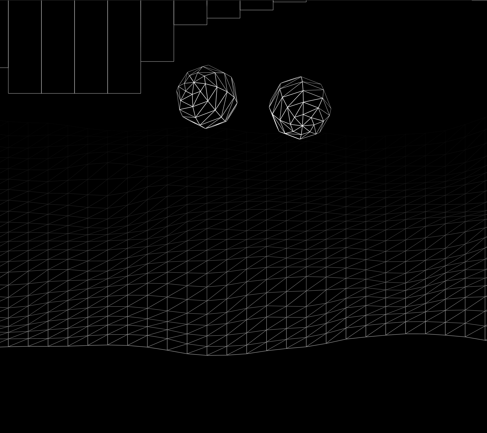
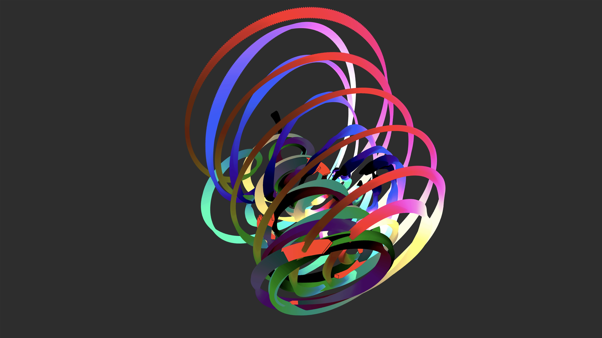
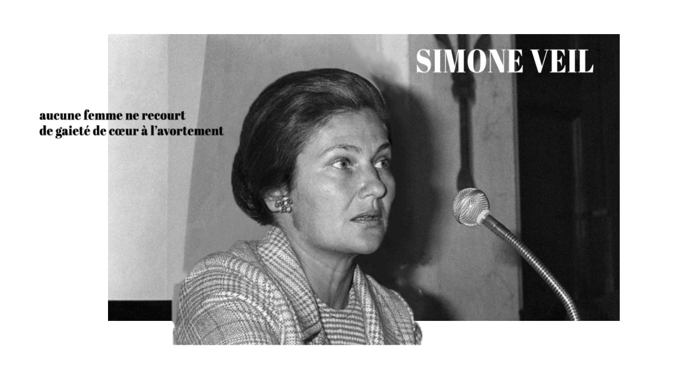
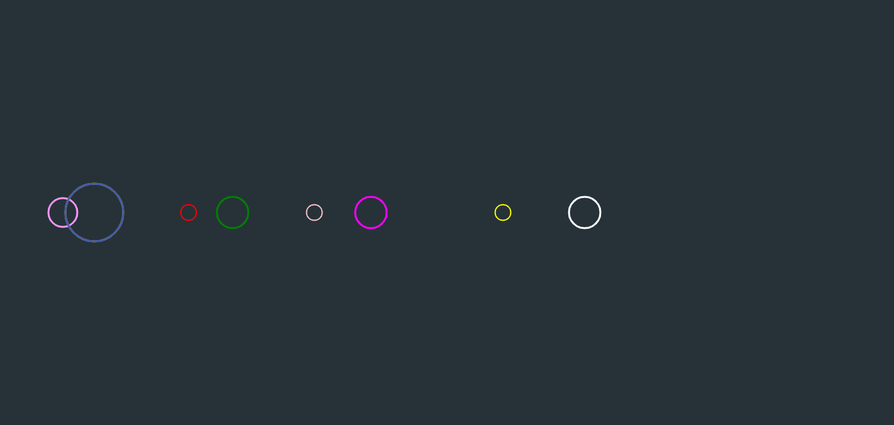
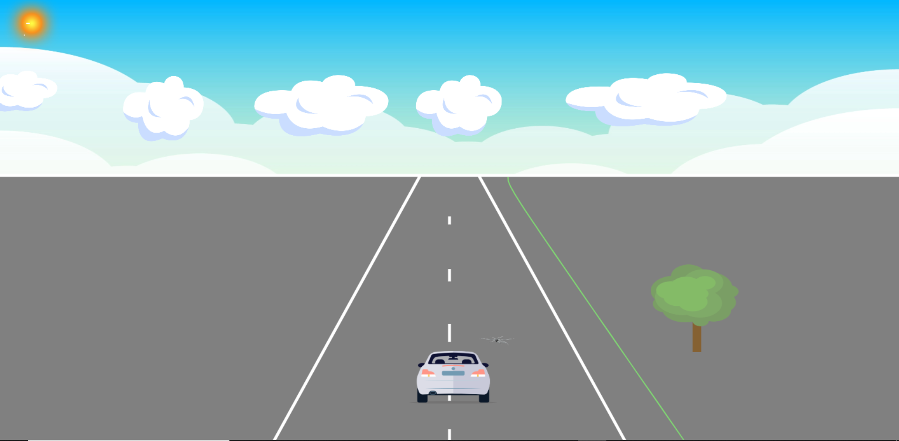
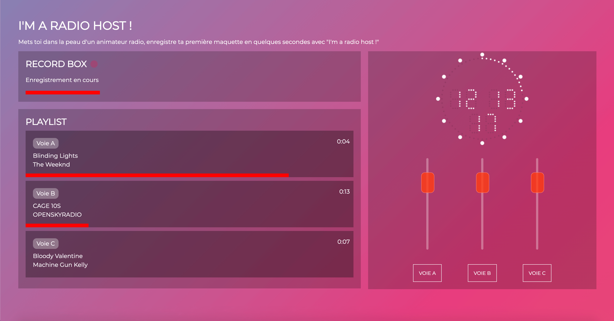

# toc

- [Maelle Aberkane](#maelle)
- [Aymeric Arnoult](#aymeric)
- [Leith Ben Abdessalem](#leith)
- [Alban Bleicher](#alban)
- [Léo Blondin](#leo)
- [Romane Chouteau](#romane)
- [Julie de Mendonca](#julie)
- [Vanina Idiart](#vanina)
- [Clara Lautre](#clara)
- [Robin Leroux](#robin)
- [Antoine Lozach](#antoine)
- [Pierre Martiniere](#pierre)
- [Guenole Moreau](#guenole)
- [Lissandre Pasdeloup](#lissandre)
- [Pierre Pinto de Oliveira](#pierrep) <!-- pierrep parce qu'il y a déjà un pierre -->
- [Valentin Salaud](#valentin)
- [Jean-Baptiste Sanchez](#jeanbaptiste)
- [Clément Savary](#clement)
- [Alexis Sejourne](#alexis)
- [Anatole Touvron](#anatole)
- [Robin Verona](#robinv) <!-- robinv parce qu'il y a déjà un robin -->

# maelle

[le nom de mon projet](https://github.com/maelle/leprojet)

## auteur
[Maelle Aberkane](http://maelle.fr)  [@maelle](https://github.com/maelle)

## l'expérience
en chantant / parlant devant un microphone l'utilisateur dessine des formes colorées

## le but
chaque voix est unique, nous avons l'habitude de l'entendre, wave.more permet de se rendre compte de cette unicité en visualisant les voix

## restitution
les empreintes de voix sont en suite accessibles dans une gallerie d'images

## techno
vanilla javascript, paperjs, express

## license
à définir

# aymeric

[le nom de mon projet](https://github.com/maelle/leprojet)

## auteur
[Maelle Aberkane](http://maelle.fr)  [@maelle](https://github.com/maelle)

## l'expérience
description de l'expérience

## le but
pourquoi cette expérience

## restitution
quelle est la restitution

## techno
vanilla javascript, paperjs, express

## license
à définir

# leith

[Valley Of Sound](https://github.com/LeithBA/ValleyOfSound)

## auteur
[Leith Ben Abdessalem](https://leithba.com)  [@leithba](https://github.com/leithba)

## l'expérience
Valley Of Sound is a musical experiment made on p5.js.
The users can play music like on a piano using their keyboard.

Controls:
1 - 7 : Play Notes
+ / - : Change Notes
T     : Change Wave Type
U / I : Change Fade
ENTER : Start/Stop Recording

## le but
Faire mumuse

## restitution
Je ne sais pas ce que restitution veut dire.

## techno
vanilla javascript, p5, express

## license
Everyone is free to use my code. Crediting is optional but appriciated.

# alban

[le nom de mon projet](https://github.com/maelle/leprojet)

## auteur
[Maelle Aberkane](http://maelle.fr)  [@maelle](https://github.com/maelle)

## l'expérience
description de l'expérience

## le but
pourquoi cette expérience

## restitution
quelle est la restitution

## techno
vanilla javascript, paperjs, express

## license
à définir

# leo

[Mid Art Color](https://github.com/leoB4/MidiArtColor)

## auteur
[Léo Blondin](http://leoblondin.com)  [@leoB4](https://github.com/leoB4)

## l'expérience
Utilisez le clavier midi, via les potentiomètres et les carrés de drum afin de créer de l'art coloré.
Suivez les instruction, sauvegarder et télécharger votre fichier.

## le but
Conquérir la beauté graphique par un moyen analogique externe insolite

## restitution
quelle est la restitution

## techno
Express, P5.js, Webmidi API

## license
à définir

# romane

[le nom de mon projet](https://github.com/maelle/leprojet)

## auteur
[Maelle Aberkane](http://maelle.fr)  [@maelle](https://github.com/maelle)

## l'expérience
description de l'expérience

## le but
pourquoi cette expérience

## restitution
quelle est la restitution

## techno
vanilla javascript, paperjs, express

## license
à définir

# julie

[Art For All](https://github.com/JuDmnca/artforall)

## auteur
[Julie De Mendonça](http://juliedemendonca.fr)  [@julie](https://github.com/JuDmnca)

## l'expérience
L'expérience permet de créer une oeuvre d'art à partir de lui en plusieurs étapes :
- rentrer son prénom
- s'enregistrer
- dessiner son oeuvre avec les données récupérées précédemment 

## le but
Le but est de créer une oeuvre d'art facilement et à partir de soi-même, c'est drôle un peu.

## restitution
On peut voir son oeuvre et celles des autres dans une superbe galerie.

## techno
vanilla javascript, p5js, express

## license
free :)

# vanina

[MuseumSounds](https://github.com//leprojet)

## auteur
[Vanina Idiart](http://vaninaidiart.fr)  [@VaninaVizc](https://github.com/Vaninavizc)

## l'expérience
Plonger dans l'Histoire en écoutant des extraits de discours clés

## le but
Allier l'Histoire, l'intéraction et le numérique

## restitution
Image

## techno
vanilla javascript, parallax.js, gsap, tweenmax

## license
//

# clara

[le nom de mon projet](https://github.com/maelle/leprojet)

## auteur
[Maelle Aberkane](http://maelle.fr)  [@maelle](https://github.com/maelle)

## l'expérience
description de l'expérience

## le but
pourquoi cette expérience

## restitution
quelle est la restitution

## techno
vanilla javascript, paperjs, express

## license
à définir

# robin

[Canvas-musique](https://github.com/robinlrx/canvas-musique)

## auteur
[Robin Leroux](https://robinleroux.fr)  [@robin](https://github.com/robinlrx/)

## l'expérience
L'utilisateur peut controler les goupes de cercles afin de jouer des sons. Chaque groupe peut être controllé individuellement afin de jouer un ou plusieurs sons.

## le but
Découvrir canvas

## restitution
image
## techno
vanilla javascript, node js, express, canvas

## license
à définir

# antoine

[le nom de mon projet](https://github.com/maelle/leprojet)

## auteur
[Maelle Aberkane](http://maelle.fr)  [@maelle](https://github.com/maelle)

## l'expérience
description de l'expérience

## le but
pourquoi cette expérience

## restitution
quelle est la restitution

## techno
vanilla javascript, paperjs, express

## license
à définir

# pierre

[le nom de mon projet](https://github.com/maelle/leprojet)

## auteur
[Maelle Aberkane](http://maelle.fr)  [@maelle](https://github.com/maelle)

## l'expérience
description de l'expérience

## le but
pourquoi cette expérience

## restitution
quelle est la restitution

## techno
vanilla javascript, paperjs, express

## license
à définir

# guenole

[Road Trip](https://github.com/gueno-m/road-trip-canvas)

## auteur
[Guénolé Moreau](https://guenolemoreau.fr/)  [@gueno-m](https://github.com/gueno-m)

## l'expérience
Expérience intereactive ou l'utilisateur contrôle une voiture avec une manette de ps4

## le but
progresser avec node.js et les canvas

## restitution
retrouvez les captures d'écran de votre partie dans la galerie

## techno
vanilla javascript, express

## license
free

# lissandre

[le nom de mon projet](https://github.com/maelle/leprojet)

## auteur
[Maelle Aberkane](http://maelle.fr)  [@maelle](https://github.com/maelle)

## l'expérience
description de l'expérience

## le but
pourquoi cette expérience

## restitution
quelle est la restitution

## techno
vanilla javascript, paperjs, express

## license
à définir

# pierrep

[le nom de mon projet](https://github.com/maelle/leprojet)

## auteur
[Maelle Aberkane](http://maelle.fr)  [@maelle](https://github.com/maelle)

## l'expérience
description de l'expérience

## le but
pourquoi cette expérience

## restitution
quelle est la restitution

## techno
vanilla javascript, paperjs, express

## license
à définir

# valentin

[le nom de mon projet](https://github.com/maelle/leprojet)

## auteur
[Maelle Aberkane](http://maelle.fr)  [@maelle](https://github.com/maelle)

## l'expérience
description de l'expérience

## le but
pourquoi cette expérience

## restitution
quelle est la restitution

## techno
vanilla javascript, paperjs, express

## license
à définir

# jeanbaptiste

[le nom de mon projet](https://github.com/maelle/leprojet)

## auteur
[Maelle Aberkane](http://maelle.fr)  [@maelle](https://github.com/maelle)

## l'expérience
description de l'expérience

## le but
pourquoi cette expérience

## restitution
quelle est la restitution

## techno
vanilla javascript, paperjs, express

## license
à définir

# clement

[I'm a Radio Host](https://github.com/clementsavary/Im_a_radio_host)

## auteur
[Clément Savary](https://clementsavary.fr)  [@clement](https://github.com/clementsavary)

## l'expérience
"I'm a Radio Host", c'est un petite application web vous permettant en quelques secondes de se mettre dans la peau d'un animateur radio. Vous serez invité à enregistrer votre intervention entre deux musiques grâce au micro de votre ordinateur ou mobile. Une fois l'enregistrement terminé, vous serez invité à le réécouter. Vous pourrez également contrôler le niveau sonore des musiques grâce aux faders de volume (comme sur une véritable table de mixage). Sympa non ? :) 

## le but
J'ai voulu créer cette application étant un passionné de radio. Il existe aucune application web permettant à tout un chacun de s'entrainer à l'animation antenne. Ce projet à également pour but de faire découvrir le panel très complet d'un animateur. J'ai voulu faire une interface conforme aux standards radio. 

## restitution
Le fichier audio de l'enregistement

## techno
JavaScript, Animate.css

## license
à définir

# alexis

[le nom de mon projet](https://github.com/maelle/leprojet)

## auteur
[Maelle Aberkane](http://maelle.fr)  [@maelle](https://github.com/maelle)

## l'expérience
description de l'expérience

## le but
pourquoi cette expérience

## restitution
quelle est la restitution

## techno
vanilla javascript, paperjs, express

## license
à définir

# anatole

[le nom de mon projet](https://github.com/maelle/leprojet)

## auteur
[Maelle Aberkane](http://maelle.fr)  [@maelle](https://github.com/maelle)

## l'expérience
description de l'expérience

## le but
pourquoi cette expérience

## restitution
quelle est la restitution

## techno
vanilla javascript, paperjs, express

## license
à définir

# robinv

[le nom de mon projet](https://github.com/maelle/leprojet)

## auteur
[Maelle Aberkane](http://maelle.fr)  [@maelle](https://github.com/maelle)

## l'expérience
description de l'expérience

## le but
pourquoi cette expérience

## restitution
quelle est la restitution

## techno
vanilla javascript, paperjs, express

## license
à définir
