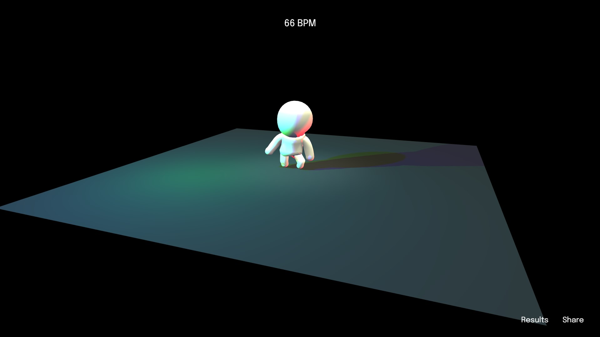

# toc

- [Maelle Aberkane](#maelle)
- [Aymeric Arnoult](#aymeric)
- [Leith Ben](#leith)
- [Alban Bleicher](#alban)
- [Léo Blondin](#leo)
- [Romane Chouteau](#romane)
- [Julie de Mendonca](#julie)
- [Vanina Idiart](#vanina)
- [Clara Lautre](#clara)
- [Robin Leroux](#robin)
- [Antoine Lozach](#antoine)
- [Pierre Martiniere](#pierre)
- [Guenole Moreau](#guenole)
- [Lissandre Pasdeloup](#lissandre)
- [Pierre Pinto de Oliveira](#pierrep) <!-- pierrep parce qu'il y a déjà un pierre -->
- [Valentin Salaud](#valentin)
- [Jean-Baptiste Sanchez](#jeanbaptiste)
- [Clément Savary](#clement)
- [Alexis Sejourne](#alexis)
- [Anatole Touvron](#anatole)
- [Robin Verona](#robinv) <!-- robinv parce qu'il y a déjà un robin -->

# maelle

[le nom de mon projet](https://github.com/maelle/leprojet)

## auteur
[Maelle Aberkane](http://maelle.fr)  [@maelle](https://github.com/maelle)

## l'expérience
en chantant / parlant devant un microphone l'utilisateur dessine des formes colorées

## le but
chaque voix est unique, nous avons l'habitude de l'entendre, wave.more permet de se rendre compte de cette unicité en visualisant les voix

## restitution
les empreintes de voix sont en suite accessibles dans une gallerie d'images

## techno
vanilla javascript, paperjs, express

## license
à définir

# aymeric

[le nom de mon projet](https://github.com/maelle/leprojet)

## auteur
[Maelle Aberkane](http://maelle.fr)  [@maelle](https://github.com/maelle)

## l'expérience
description de l'expérience

## le but
pourquoi cette expérience

## restitution
quelle est la restitution

## techno
vanilla javascript, paperjs, express

## license
à définir

# leith

[le nom de mon projet](https://github.com/maelle/leprojet)

## auteur
[Maelle Aberkane](http://maelle.fr)  [@maelle](https://github.com/maelle)

## l'expérience
description de l'expérience

## le but
pourquoi cette expérience

## restitution
quelle est la restitution

## techno
vanilla javascript, paperjs, express

## license
à définir

# alban

[le nom de mon projet](https://github.com/maelle/leprojet)

## auteur
[Maelle Aberkane](http://maelle.fr)  [@maelle](https://github.com/maelle)

## l'expérience
description de l'expérience

## le but
pourquoi cette expérience

## restitution
quelle est la restitution

## techno
vanilla javascript, paperjs, express

## license
à définir

# leo

[le nom de mon projet](https://github.com/maelle/leprojet)

## auteur
[Maelle Aberkane](http://maelle.fr)  [@maelle](https://github.com/maelle)

## l'expérience
description de l'expérience

## le but
pourquoi cette expérience

## restitution
quelle est la restitution

## techno
vanilla javascript, paperjs, express

## license
à définir

# romane

[Nightclub](https://github.com/romanechouteau/nightclub)

## auteur
[Romane Chouteau](https://www.romanechouteau.fr/)  [@romane](https://github.com/romanechouteau)

## l'expérience
Le concept de l'expérience est de faire danser un bonhomme sur une musique selectionnée selon le rythme indiqué par l'utilisateur. L'utilisateur tape dans ses mains pour indiquer le rythme, puis une musique correspondant au BPM est selectionnée et jouée, et le bonhomme danse alors en rythme.

## le but
Le but est d'un côté d'écouter une musique ayant le rythme qu'on a clapé, et de l'autre de voir un petit bonhomme mignon danser en rythme.

## restitution
La restitution est de voir la liste des musiques que l'on a jouées et le BPM correspondant. On sauvegarde cette liste et donc on peut voir les playlists des autres utilisateurs.

## techno
vanilla javascript, three.js, express, deezer api

## license
Free

# julie

[le nom de mon projet](https://github.com/maelle/leprojet)

## auteur
[Maelle Aberkane](http://maelle.fr)  [@maelle](https://github.com/maelle)

## l'expérience
description de l'expérience

## le but
pourquoi cette expérience

## restitution
quelle est la restitution

## techno
vanilla javascript, paperjs, express

## license
à définir

# vanina

[le nom de mon projet](https://github.com/maelle/leprojet)

## auteur
[Maelle Aberkane](http://maelle.fr)  [@maelle](https://github.com/maelle)

## l'expérience
description de l'expérience

## le but
pourquoi cette expérience

## restitution
quelle est la restitution

## techno
vanilla javascript, paperjs, express

## license
à définir

# clara

[le nom de mon projet](https://github.com/maelle/leprojet)

## auteur
[Maelle Aberkane](http://maelle.fr)  [@maelle](https://github.com/maelle)

## l'expérience
description de l'expérience

## le but
pourquoi cette expérience

## restitution
quelle est la restitution

## techno
vanilla javascript, paperjs, express

## license
à définir

# robin

[le nom de mon projet](https://github.com/maelle/leprojet)

## auteur
[Maelle Aberkane](http://maelle.fr)  [@maelle](https://github.com/maelle)

## l'expérience
description de l'expérience

## le but
pourquoi cette expérience

## restitution
quelle est la restitution

## techno
vanilla javascript, paperjs, express

## license
à définir

# antoine

[le nom de mon projet](https://github.com/maelle/leprojet)

## auteur
[Maelle Aberkane](http://maelle.fr)  [@maelle](https://github.com/maelle)

## l'expérience
description de l'expérience

## le but
pourquoi cette expérience

## restitution
quelle est la restitution

## techno
vanilla javascript, paperjs, express

## license
à définir

# pierre

[le nom de mon projet](https://github.com/maelle/leprojet)

## auteur
[Maelle Aberkane](http://maelle.fr)  [@maelle](https://github.com/maelle)

## l'expérience
description de l'expérience

## le but
pourquoi cette expérience

## restitution
quelle est la restitution

## techno
vanilla javascript, paperjs, express

## license
à définir

# guenole

[le nom de mon projet](https://github.com/maelle/leprojet)

## auteur
[Maelle Aberkane](http://maelle.fr)  [@maelle](https://github.com/maelle)

## l'expérience
description de l'expérience

## le but
pourquoi cette expérience

## restitution
quelle est la restitution

## techno
vanilla javascript, paperjs, express

## license
à définir

# lissandre

[le nom de mon projet](https://github.com/maelle/leprojet)

## auteur
[Maelle Aberkane](http://maelle.fr)  [@maelle](https://github.com/maelle)

## l'expérience
description de l'expérience

## le but
pourquoi cette expérience

## restitution
quelle est la restitution

## techno
vanilla javascript, paperjs, express

## license
à définir

# pierrep

[le nom de mon projet](https://github.com/maelle/leprojet)

## auteur
[Maelle Aberkane](http://maelle.fr)  [@maelle](https://github.com/maelle)

## l'expérience
description de l'expérience

## le but
pourquoi cette expérience

## restitution
quelle est la restitution

## techno
vanilla javascript, paperjs, express

## license
à définir

# valentin

[le nom de mon projet](https://github.com/maelle/leprojet)

## auteur
[Maelle Aberkane](http://maelle.fr)  [@maelle](https://github.com/maelle)

## l'expérience
description de l'expérience

## le but
pourquoi cette expérience

## restitution
quelle est la restitution

## techno
vanilla javascript, paperjs, express

## license
à définir

# jeanbaptiste

[le nom de mon projet](https://github.com/maelle/leprojet)

## auteur
[Maelle Aberkane](http://maelle.fr)  [@maelle](https://github.com/maelle)

## l'expérience
description de l'expérience

## le but
pourquoi cette expérience

## restitution
quelle est la restitution

## techno
vanilla javascript, paperjs, express

## license
à définir

# clement

[le nom de mon projet](https://github.com/maelle/leprojet)

## auteur
[Maelle Aberkane](http://maelle.fr)  [@maelle](https://github.com/maelle)

## l'expérience
description de l'expérience

## le but
pourquoi cette expérience

## restitution
quelle est la restitution

## techno
vanilla javascript, paperjs, express

## license
à définir

# alexis

[le nom de mon projet](https://github.com/maelle/leprojet)

## auteur
[Maelle Aberkane](http://maelle.fr)  [@maelle](https://github.com/maelle)

## l'expérience
description de l'expérience

## le but
pourquoi cette expérience

## restitution
quelle est la restitution

## techno
vanilla javascript, paperjs, express

## license
à définir

# anatole

[le nom de mon projet](https://github.com/maelle/leprojet)

## auteur
[Maelle Aberkane](http://maelle.fr)  [@maelle](https://github.com/maelle)

## l'expérience
description de l'expérience

## le but
pourquoi cette expérience

## restitution
quelle est la restitution

## techno
vanilla javascript, paperjs, express

## license
à définir

# robinv

[le nom de mon projet](https://github.com/maelle/leprojet)

## auteur
[Maelle Aberkane](http://maelle.fr)  [@maelle](https://github.com/maelle)

## l'expérience
description de l'expérience

## le but
pourquoi cette expérience

## restitution
quelle est la restitution

## techno
vanilla javascript, paperjs, express

## license
à définir
