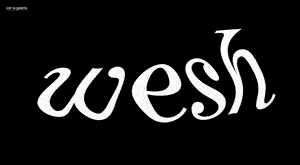
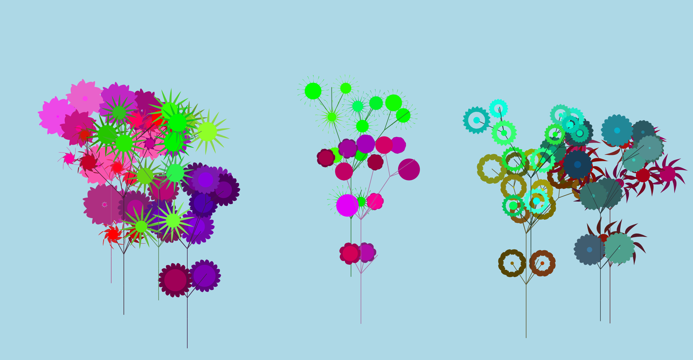
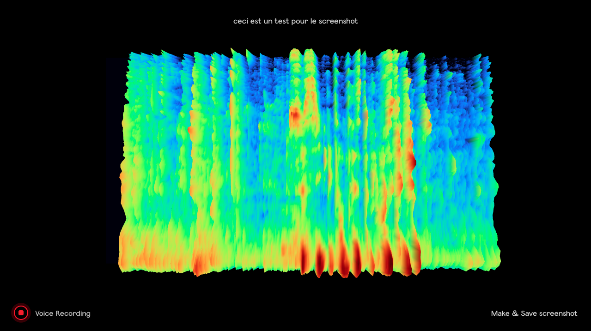
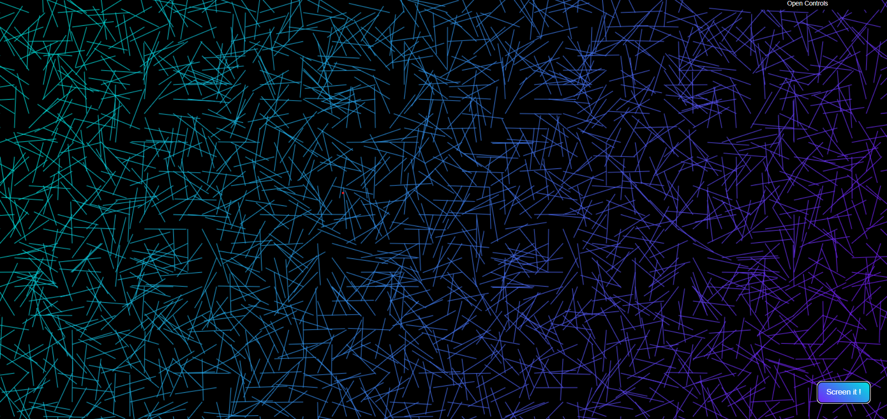
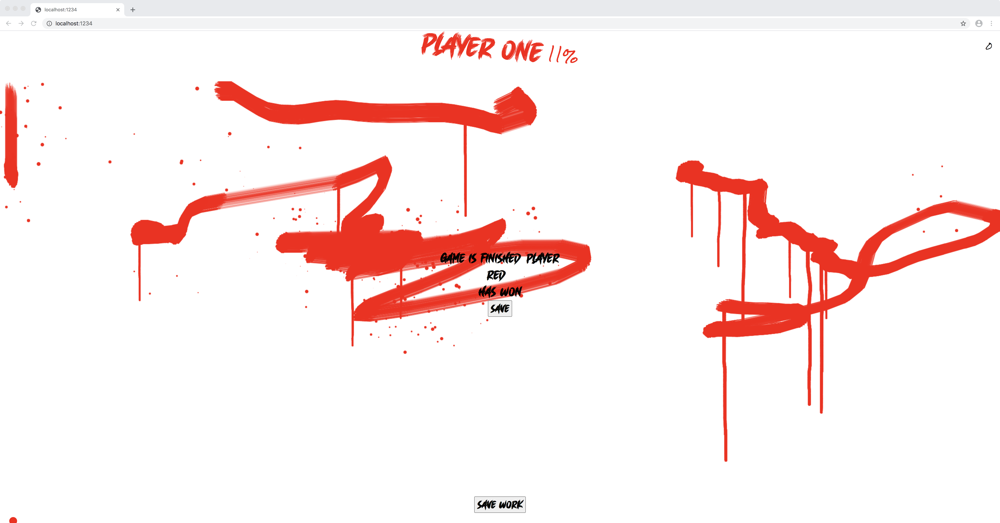
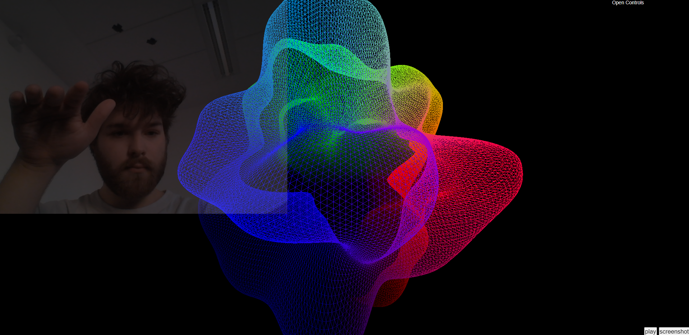
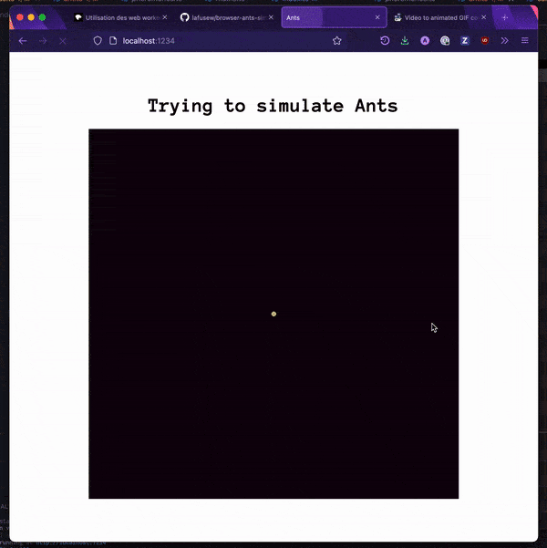
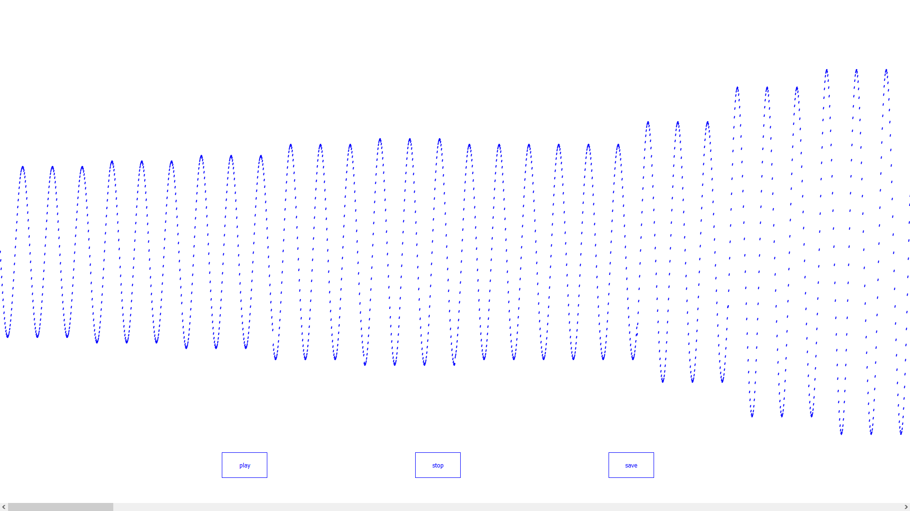
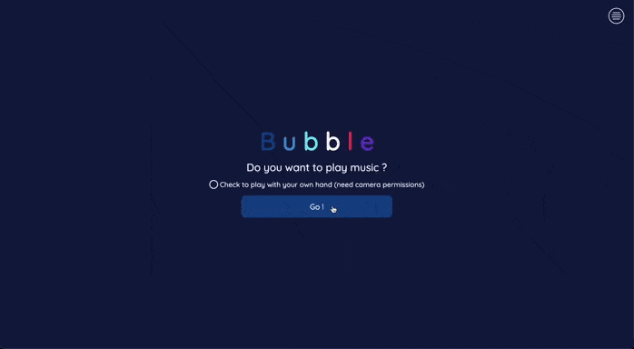
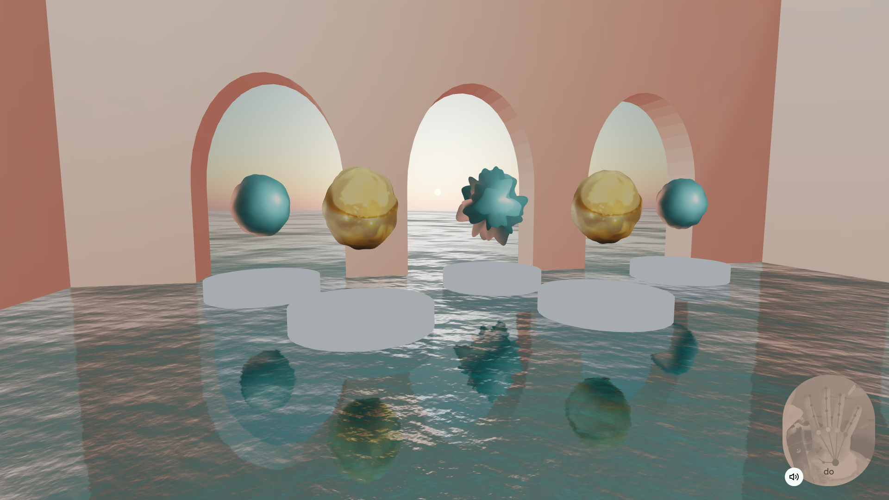

# toc

- [Quentin Barroca](#quentin)
- [Loris Birkemeyer](#loris)
- [Enzo Cailleton](#enzo)
- [Tibère Debizet](#tibere)
- [Elsa Delmas](#elsa)
- [Charles-Antoine Dupuy](#charles-antoine)
- [Hugo Faugeroux](#hugo)
- [Alexandre Gettefossé](#alexandre)
- [Ulysse Gravier](#ulysse)
- [Léonie Grimoin](#leonie)
- [Thoma Lecornu](#thoma)
- [Pierre-Alexis Maldera](#pa)
- [Evan Martin](#evan)
- [Pierre Notin](#pierre)
- [Antoine Oddoz](#antoine)
- [Titouan Pellerin](#titouan)
- [Justin Quillévéré](#justin)
- [Maelle Rabouan](#maelle)
- [Antoine Tardivel](#antoinet) <!-- antoinet parce qu'il y a déjà un antoine -->

# quentin

[spatialship & potatoes](https://github.com/qbarr/jsavance)

## auteur

[Quentin barroca]() [@pseudogithub](https://github.com/qbarr)

## l'expérience

Jeu multijoueur permettant de manipuler un vaisseau pour traverser le camp ennemi sans se faire toucher.

Le joueur 1 manipule une direction et le joueur 2 manipule la seconde direction. La direction est géré par une patate !

Plus on s'approche des ennnemis, plus le vaisseau se met à s'alerter (alarme sonore). Le but étant de les esquiver.

## le but

Expérimenter le canvas sans librairies !

## techno

javascript, express, socket.io

## license

<!-- license, ça peut être du texte -->

Everyone is free to use my code. Crediting is optional but appriciated.

<!-- ou la wtfpl http://www.wtfpl.net/ -->

# loris

Orientation-driven audio

[repo github](https://github.com/loristewis/gob_orientation_audio)

[démo](https://gob-orientation-audio.netlify.app/) (à ouvrir sur un ordinateur + un ou deux téléphones/tablettes)

## auteur

Loris Birkemeyer [@loristewis](https://github.com/loristewis)

## l'expérience

En jouant avec l’orientation du téléphone, l’utilisateur fait varier le son émis par l'ordinateur.

## techno

JavaScript, Express, Socket.io

## license

wtfpl http://www.wtfpl.net/

# enzo

[Evans attack](https://github.com/ZoCailleton/martaupe)

[démo](http://evansattack.surge.sh)

## auteur

[Enzo Cailleton](https://enzocailleton.com) [@ZoCailleton](https://github.com/ZoCailleton)

## l'expérience

Interface permettant de donner des taquets à des taupes prenant différentes formes avec une épée Minecraft.

## le but

M'amuser et découvrir des technos de reconnaissances faciales.

## restitution

Une tableau des scores

## techno

javascript, express, handtrack.js

## license

Everyone is free to use my code. Crediting is optional but appriciated.

# tibere

[Play your head](https://github.com/TibereDbzt/play-your-head)
[Lien du repo](https://github.com/TibereDbzt/play-your-head)

## auteur

[Tibère Debizet](https://tiberedebizet.fr/) [@tiberedbzt](https://github.com/tiberedbzt)

## l'expérience

Vous chantez sans vraiment chanter. Plus vous ouvrez la bouche, plus vous chanterez des harmoniques aigues et inversement. En levant et baissant les sourcils, vous jouez sur le gain général des voix.

## le but

C'est juste un peu marrant

## restitution

Un screen de ta tête lorsque le gain est au maxxx (tes sourcils sont levés à balle).

## techno

javascript, face-api.js, events.js, express

## license

Everyone is free to use my code. Crediting is optional but appriciated.

# elsa

## speech visualizer

<!-- nom de l'expérience, lien vers le code-->

[→ repo](https://github.com/elsadl/speech-visualizer)

<!-- s'il y a une démo, mettez le lien-->

[→ démo](https://speech-visualizer.netlify.app/) (chrome only....)

## auteur

[Elsa Delmas](https://elsadelmas.fr/) [@elsadl](https://github.com/elsadl)

## l'expérience

une interface qui écrit les mots que l'on prononce (il faut maintenir la touche 'S' enfoncée pour activer la reconnaissance vocale), et qui prend une capture d'écran de chaque mot affiché à l'écran

## le but
c'est rigolo

## restitution

une galerie-historique des mots

## techno

svelte, express, web speech api, webaudio, blotter.js, svelte

## license

CC BY-SA 4.0

# charles-antoine

[Déformation](https://github.com/cadupuy/web-audio-experience)

## auteur

[Charles-Antoine Dupuy](https://www.charlesantoinedupuy.com/) [@cadupuy](https://github.com/cadupuy)

## l'expérience

Interface permettant d'intéragir avec des particules en utilisant sa voix. L'environnement entourant l'utilisateur est recrée sour forme de particules qui se déforment au son de sa voix.

## le but

Amuser l'utilisateur au travers d'une perception de son environnement qui lui ai étrangère.

## restitution

Un screenshot réalisé lors de l'expérience

## techno

JavaScript, NodeJS, Express, ThreeJS, Canvas

## license

Free

# hugo

<!-- nom de l'expérience, lien vers le code-->

[Flower Generator](https://github.com/Hugofgx9/flower)

<!-- s'il y a une démo, mettez le lien-->

<!-- essayez de mettre un gif, s'il y a une interaction sympa avec l'utilisateur et des patates, pensez à montrer l'utilisateur aussi !-->

## auteur

<!-- qui etes vous, lien + pseudo github) -->

[Hugo Faugeroux](https://hugofaugeroux.com), [@Hugofgx9](https://github.com/Hugofgx9)

## l'expérience

Interface permettant de représenter chaque utilisateur derrière la camera par une fleur auto-générée, grâce à l'algorythme L-system.

## le but

S'amuser, découvrir des techno (tensorflow notamment), et l'art génératif.

## techno

javascript, express, paperjs, tensoflowjs

## license

<!-- license, ça peut être du texte -->

Everyone is free to use my code. Crediting is optional but appriciated.

<!-- ou la wtfpl http://www.wtfpl.net/ -->

# alexandre

<!-- nom de l'expérience, lien vers le code-->
[Vortex](https://github.com/Dakumisu/sound_exp)

<!-- s'il y a une démo, mettez le lien-->
[démo](https://sound-exp.vercel.app/)

<!-- essayez de mettre un gif, s'il y a une interaction sympa avec l'utilisateur et des patates, pensez à montrer l'utilisateur aussi !-->

## auteur

<!-- qui etes vous, lien + pseudo github) -->
[Alex Gattefossé](https://dakumisu.fr)  [@Dakumisu](https://github.com/Dakumisu)

## l'expérience

<!-- petite description de l'expérience-->

Vortex est une expérience sensorielle en WebGL avec un max d'effets

## le but

<!-- avez-vous un but? sinon trouvez-en un :D parfois s'amuser, c'est un but -->
Un max de particules et de fun 🏓

## restitution

<!-- ça c'est souvent la même chose, si votre projet utilise node pour du websocket, vous pouvez virer cette section-->
Musiques Souncloud

## techno

<!-- quelles technos vous avez utilisé-->
javascript, threejs, glsl, Soudcloud API

## license

<!-- license, ça peut être du texte -->

Everyone is free to use my code. Crediting is optional but appriciated.

<!-- ou la wtfpl http://www.wtfpl.net/ -->

# ulysse

[Spectrum analyser](https://github.com/Ulysseee/spectrum-analyser)

## auteur

[Ulysse Gravier](https://ulyssegravier.fr)  [@pseudogithub](https://github.com/Ulysseee)

## l'expérience

<!-- petite description de l'expérience-->

L’expérience consiste à faire visualiser le spectre sonore d’une source, notamment celle de la voix, à partir du microphone de l’utilisateur. Une fois l’expérience lancée, le spectre s’anime automatiquement au fur et à mesure que la source produira du son. 

Si la source s’avère être une voix, les paroles seront captés par reconnaissance vocale via le micro et affichées en temps réel en complément du spectre sonore. 

## le but

La concu d’audacity

## restitution

<!-- ça c'est souvent la même chose, si votre projet utilise node pour du websocket, vous pouvez virer cette section-->

Un screenshot du spectre audio capté.

## techno

React, ThreeJS, Express, API Web Speech

## license

<!-- license, ça peut être du texte -->

Everyone is free to use my code. Crediting is optional but appriciated.

<!-- ou la wtfpl http://www.wtfpl.net/ -->

# leonie

<!-- nom de l'expérience, lien vers le code-->

[Sound visualizer](https://github.com/leoniedarois/experience-gob)

<!-- s'il y a une démo, mettez le lien-->

[démo](https://sound-visualizer-leoniedarois.netlify.app/)

<!-- essayez de mettre un gif, s'il y a une interaction sympa avec l'utilisateur et des patates, pensez à montrer l'utilisateur aussi !-->

## auteur

<!-- qui etes vous, lien + pseudo github) -->

[Leonie Grimoin](https://leonie-grimoin.netlify.app/) [@leoniedarois](https://github.com/leoniedarois)

## l'expérience

<!-- petite description de l'expérience-->

L'interface permet de retranscrir la son: voix, musique et son ambiant visuellement.

## le but

<!-- avez-vous un but? sinon trouvez-en un :D parfois s'amuser, c'est un but -->

Tester de nouvelle chose avec le micro et canvas.

## restitution

<!-- ça c'est souvent la même chose, si votre projet utilise node pour du websocket, vous pouvez virer cette section-->

Une gallerie de compositions sonores

## techno

javascript, express

## license

<!-- license, ça peut être du texte -->

Everyone is free to use my code. Crediting is optional but appriciated.

<!-- ou la wtfpl http://www.wtfpl.net/ -->

# thoma

<!-- nom de l'expérience, lien vers le code-->

[Live Painter](https://github.com/AyymericArn/LivePainter)

<!-- s'il y a une démo, mettez le lien-->

[démo](http://www.music-line.valentinsld.fr/)

<!-- essayez de mettre un gif, s'il y a une interaction sympa avec l'utilisateur et des patates, pensez à montrer l'utilisateur aussi !-->

## auteur

<!-- qui etes vous, lien + pseudo github) -->

[Quentin barroca](https://maelleaber.fr) [@pseudogithub](https://github.com/pseudogithub)

## l'expérience

<!-- petite description de l'expérience-->

Interface permettant de créer des sons en fonction d'un dessin créé à la souris ou au doigt pour les supports tablette. En fonction du dessin réalisé et de sa position sur le canvas les sons diffèrent de fréquence et de gain.

La couleur et la largeur de la brush sont personnalisables. Plus la couleur est foncée moins le gain est important et plus elle est claire, plus il l'est. Plus la brush est large plus la fréquence est élevée, plus elle fine, moins elle l'est.

## le but

<!-- avez-vous un but? sinon trouvez-en un :D parfois s'amuser, c'est un but -->

Faire prendre conscience de la diversité de la faune sous-marine

## restitution

<!-- ça c'est souvent la même chose, si votre projet utilise node pour du websocket, vous pouvez virer cette section-->

Une gallerie de compositions sonores

## techno

<!-- quelles technos vous avez utilisé-->

javascript, express, socket.io, threejs, matterjs

## license

<!-- license, ça peut être du texte -->

Everyone is free to use my code. Crediting is optional but appriciated.

<!-- ou la wtfpl http://www.wtfpl.net/ -->

# pa

[FindAndEar](https://github.com/Pamovoc/gob-webaudio)

<!-- s'il y a une démo, mettez le lien-->
[démo](soon)

<!-- essayez de mettre un gif, s'il y a une interaction sympa avec l'utilisateur et des patates, pensez à montrer l'utilisateur aussi !-->

## auteur

[Pierre-Alexis Maldera](https://pamavoc.com)  [@pamavoc](https://github.com/pamavoc)

## l'expérience

<!-- petite description de l'expérience-->

Un tableau 2D avec des sons à découvrir grace à vos yeux et vos oreilles.

Pour la faire courte, vous incarnez un détective privé. Munie de votre lampe torche et de vos deux grosses oreilles, vous devrez trouver les sons du tableau en moins d'une minute.

## le but

Proposer une expérience agréable à prendre en main.

## restitution

un GIF d'une partie de la session de jeu (on est limité techniquement on peut pas enregistrer 8000 screenshots déso pas déso)

## techno

javascript, express, nodejs avec server-side event, gamepad API

## license

<!-- license, ça peut être du texte -->

Everyone is free to use my code. Crediting is optional but appriciated.

<!-- ou la wtfpl http://www.wtfpl.net/ -->

# evan

[Art ID](https://github.com/evanmartiin/art-id)

<!-- s'il y a une démo, mettez le lien-->

[démo]()

## auteur

[Evan Martin](https://www.evanmartin.fr/) [@evanmartiin](https://github.com/evanmartiin)

## l'expérience

Art ID permet de créer pour chaque personne, en fonction d'un prénom et d'une date de naissance, une empreinte artistique unique, à la manière d'une empreinte digitale.

## le but

Créer une sorte de QR Code personnel qui ramènerait vers son profil.

## restitution

La liste de toutes les empreintes créées.

## techno

Javascript, Express, Svelte

## license

Everyone is free to use my code. Crediting is optional but appreciated.

# pierre

[Virtual Synthesizer](https://github.com/Heskir/experience-virtual-synthesizer)

## auteur

[Pierre Nottin]  [@pseudogithub](https://github.com/heskir)

## l'expérience

<!-- petite description de l'expérience-->
Interface permettant de controler un synthétiseur à l'aide de la reconaissance de la main. 
On peut ainsi faire varier différents facteurs et passer d'un son à l'autre à l'aide de la main.
Un mesh accompagne l'expérience, nous permettant de visualiser les différents changements que l'on effectue.

## le but

Expérimenter avec les shadders et la reconnaissance des mains

## restitution

Une gallerie d'images

## techno

javascript, express, threejs, shadders, tenserflowJs

## license

<!-- license, ça peut être du texte -->

Everyone is free to use my code. Crediting is optional but appriciated.

<!-- ou la wtfpl http://www.wtfpl.net/ -->

# Antoine

<!-- nom de l'expérience, lien vers le code-->

[Ant Simulator](https://github.com/lafusew/browser-ants-simulation)

<!-- s'il y a une démo, mettez le lien-->

[Broken Demo (to be fix)](https://6171e53de6fa8f113bee7c49--vigilant-brahmagupta-eacbc7.netlify.app/)

<!-- essayez de mettre un gif, s'il y a une interaction sympa avec l'utilisateur et des patates, pensez à montrer l'utilisateur aussi !-->

## auteur

<!-- qui etes vous, lien + pseudo github) -->

[Antoine Oddoz](https://oddoz.org) [@lafusew](https://github.com/lafusew)

## l'expérience

<!-- petite description de l'expérience-->

C'est un experience au sens propre. Le seul problème c'est que c'est une experience pour le developpeur plus que pour l'utilisateur.
Nous avons essayer de simuler une fourmilière, pour cela nous avons regardé comment les fourmis s'organisent entre elles.
Chaque fourmi se déplace de manière assez naturelle et aléatoire sur la map. En se deplaçant les fourmis déposent des phéromones dont on affiche la concentration en rouge.

#### Quelques ressources qui nous ont servis:

- [C++ implmentation](https://github.com/johnBuffer/AntSimulator)
- [The Effect of Trail Pheromones](https://www.ncbi.nlm.nih.gov/pmc/articles/PMC4784821)

## le but

Montrer qu'avec des comportements individuels simples, apliqués par toute une communautée, on peut arriver à des comportements de groupe qui sont complexe et qui semble relever de l'intelligence

## restitution

Un canvas non fini et très mal optimizé mais qui va le devenir sous peu. Production version injouable (les perfs :/)

## techno

Typescript & Vanilla Canvas. Eventually AssemblyScript & Workers for optimizing and be able to render more Ants. (To be done)

## license

Go ahead and fork it. If someone wants to help me to finish it in the cleanest and most optimized way, I'd love to.

# titouan

<!-- nom de l'expérience, lien vers le code-->

[Northern Lights Experiment](https://github.com/titouan-pellerin/northern-lights-experiment)

<!-- s'il y a une démo, mettez le lien-->

[Démo](https://northern-lights-experiment.netlify.app)

[Controleur (mobile)](https://northern-lights-controller.netlify.app)

## auteur

[Titouan Pellerin](https://titouanpellerin.info/) [@titouan-pellerin](https://github.com/titouan-pellerin)

## l'expérience

<!-- petite description de l'expérience-->

Visualisation d'aurores boréales au rythme de la musique. Le lien vers le controleur (mobile) permet d'appliquer un effet sonore en fonction de l'orientation du téléphone.

## le but

Découvrir les shaders et la Web Audio API : expérimenter

## techno

javascript, express, socket.io, threejs, Spotify API

## license

Everyone is free to use my code. Crediting is optional but appreciated.

# justin

<!-- nom de l'expérience, lien vers le code-->

[Meteo Canvas](https://github.com/justinqllvr/MeteoCanvas)

<!-- s'il y a une démo, mettez le lien-->

<!-- essayez de mettre un gif, s'il y a une interaction sympa avec l'utilisateur et des patates, pensez à montrer l'utilisateur aussi !-->

## auteur

<!-- qui etes vous, lien + pseudo github) -->

[Justin Quillévéré](https://justinquillevere.fr) [@pseudogithub](https://github.com/justinqllvr)

## l'expérience

Interface interprétant des données météo :
-la taille des vagues de la semaine visualisées sous forme d'un tourbillon.
-la force du vent de la semaine visualisée sous la forme d'un son.

## le but

<!-- avez-vous un but? sinon trouvez-en un :D parfois s'amuser, c'est un but -->

Le but était de s'amuser avec les données météos.

## restitution

Une gallerie de tourbillons.

## techno

javascript, express, WebAudioApi

## license

<!-- license, ça peut être du texte -->

Everyone is free to use my code. Crediting is optional but appriciated.

<!-- ou la wtfpl http://www.wtfpl.net/ -->

# maelle

<!-- nom de l'expérience, lien vers le code-->

[Bubble Music](https://github.com/Maelle05/BubbleMusic-front)

<!-- s'il y a une démo, mettez le lien-->

[démo](https://bubblemusic.netlify.app/)

<!-- essayez de mettre un gif, s'il y a une interaction sympa avec l'utilisateur et des patates, pensez à montrer l'utilisateur aussi !-->

## auteur

[Maëlle Rabouan](https://maellerabouan.com/) [@Maelle05](https://github.com/Maelle05)

## l'expérience

<!-- petite description de l'expérience-->

Interface permet de créer et enregistrer une musique à partir de bulles.
Chaque bulle de couleur correspond a une note, et l'utilisateur en les faisent exploser crée une mélodie.
L'utilisateur peut utiliser son curseur ou son point grâce à un tracking vidéo (require Camera)

## le but

Pas de but juste du fun.

## restitution

<!-- ça c'est souvent la même chose, si votre projet utilise node pour du websocket, vous pouvez virer cette section-->

Une gallerie de compositions sonores

## techno

<!-- quelles technos vous avez utilisé-->

javascript, canvas, handTrack.js, express server

## license

<!-- license, ça peut être du texte -->

Everyone is free to use my code. Crediting is optional but appreciated.

<!-- ou la wtfpl http://www.wtfpl.net/ -->

# antoinet

<!-- nom de l'expérience, lien vers le code-->

[Remote music hand](https://github.com/antoinetardivel/remote-music-hand)

<!-- s'il y a une démo, mettez le lien-->

[démo](https://handify.netlify.app/)

<!-- essayez de mettre un gif, s'il y a une interaction sympa avec l'utilisateur et des patates, pensez à montrer l'utilisateur aussi !-->

## auteur

<!-- qui etes vous, lien + pseudo github) -->

[Antoine Tardivel](https://antoinetardivel.com) [@pseudogithub](https://github.com/antoinetardivel)

## l'expérience

<!-- petite description de l'expérience-->

Interface permettant de créer des sons en fonction des gestes de la main. Il y'a une note par doigts baissé. Il vous faut donc baisser les doigts les un apres les autres pour créer votre musique.

## le but

<!-- avez-vous un but? sinon trouvez-en un :D parfois s'amuser, c'est un but -->

Apprendre la 3D.

## restitution

<!-- ça c'est souvent la même chose, si votre projet utilise node pour du websocket, vous pouvez virer cette section-->

Une gallerie de compositions sonores

## techno

<!-- quelles technos vous avez utilisé-->

typescript, TensorFlow, hapi, threejs, mongodb

## license

<!-- license, ça peut être du texte -->

Everyone is free to use my code. Crediting is optional but appriciated.

<!-- ou la wtfpl http://www.wtfpl.net/ -->
