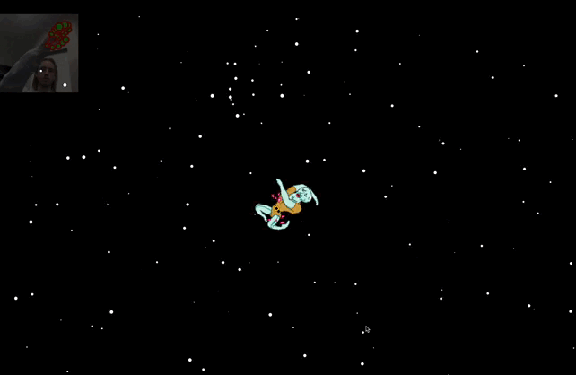
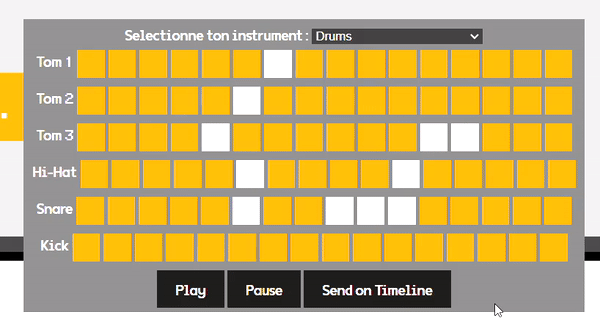
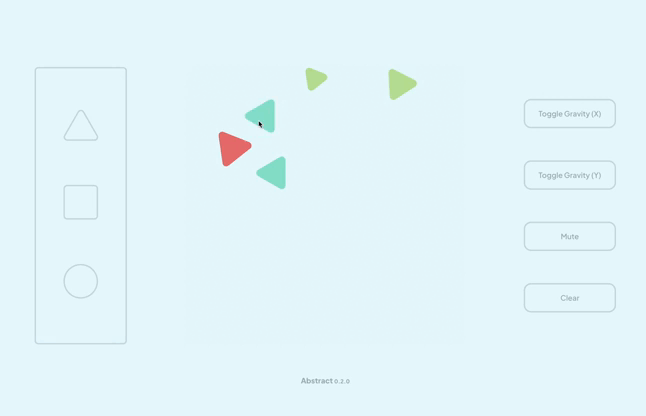
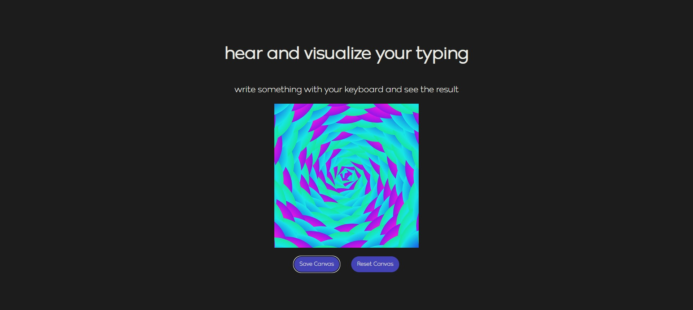
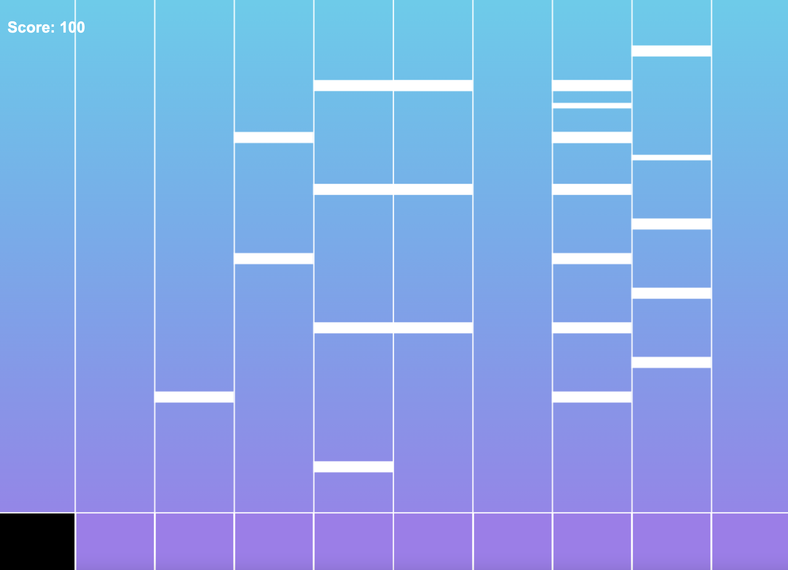
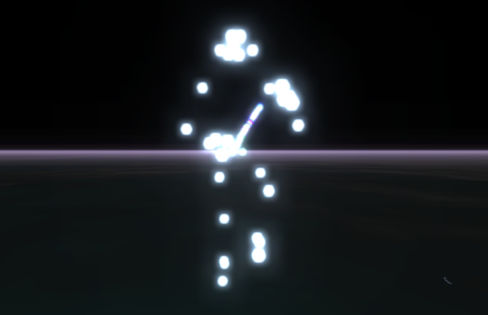

# toc

- [Lucien Boisseau-Sablé](#lucien)
- [Christelle Boquillion](#christelle)
- [Edward Brunetiere](#edward)
- [Victor Cango](#victorc)
- [Antoine Droyer](#antoined)
- [Léna Eng](#lena)
- [Antoine Galy](#antoineg)
- [Ibrahima Kaba](#ibra)
- [Anna-Maria Lannaud](#annamaria)
- [Estellle Lay](#estelle)
- [Aurélien Louvel](#aurelien)
- [Jules Mesnil](#jules)
- [Néo Miannay](#neo)
- [Nicolas Neveu](#nicolas)
- [Louise Peridy](#louise)
- [Amandine Quellec](#amandine)
- [Clément Renou](#clement)
- [Adel Sanaa](#adel)
- [Victor Sin](#victors)

# lucien

[switch matter](https://github.com/LucienGobelins/SwitchMatter)

## auteur

[Lucien Boisseau](https://lucienboisseau.fr) [@LucienGobelins](https://github.com/LucienGobelins)

## l'expérience

Jeu multijoueur alliant adresse et convivialité. Chaque joueur armé de sa petites manettes Switch Joycon ® doit accumuler des diamants tout en pénalisant les autres joueurs en les percutant.

Plus le joueur a accumulé de diamants, moins il est vulnérable, mais plus il a de mal à se déplacer

## le but

L'expérienc eest une métaphore de l'insoutenable légerté de l'être qui porte à la méditation sur la vacuité de la vie et la futilité du du libre arbitre dans une logique de déterminisme absolu.

C'est une référence évidente à l'oevre de Stig Dagerman, notamment son pamphlet postume "Notre besoin de consolation est impossible à rassasier" – Vårt behov av tröst är omättligt — 1952.

## techno

javascript, express, socket.io, matterjs, gamepad api, café noisette

## license

Everyone is free to use my code. Crediting is optional but appriciated.

<!-- vous pouvez aussi opter pour la wtfpl http://www.wtfpl.net/ -->

# christelle

[PIXTONE](https://github.com/christelle-bqn/pixtone)

## auteur

[Christelle Boquillion](https://twitter.com/BqnChristelle) [@ChristelleBqn](https://github.com/christelle-bqn)

## l'expérience

Créez des mélodies grâce à du pixel art !

## le but

Découvrir et expérimenter la Web Audio API avec Canvas 2D.

## techno

javascript, canvas 2d, web audio api

## license

Everyone is free to use my code. Crediting is optional but appreciated.

# antoined

[Vibing Carlos](https://github.com/Bigoou/Chilling-Carlos/tree/main/carlos-chilling)

## auteur

[Antoine Droyer](https://www.instagram.com/antoine_dryr/) [@Bigoou](https://github.com/Bigoou)

## l'expérience

Carlos ce giga chad se retrouve en transe dans l'espace et se fait contrôler par une mystérieuse force (toi et ta main) pour se laisser bercer entre les étoiles, explorant ainsi l'infini de l'existence. 

## le but

J'aime bien carlos et c'est rigolo d'utiliser la main pour interagir avec l'écran. En plus j'ai toujours rêvé de faire bouger les choses avec la pensée comme un bon gros geek

## techno

javascript, vite, paperjs, mediapipe

## license

Everyone is free to use my code. Crediting is optional but appriciated.

# edward

<!-- complétez ci-dessous les différentes parties et supprimez les commentaires, puis prévenez @gasp quand la pull request est prête-->

[Online Drums Machine](https://github.com/P4tt4te/concerto-experience)

## auteur

[Brunetiere Edward](https://www.edwbr.dev/) [@P4tt4te](https://github.com/P4tt4te)

## l'expérience

Drums machine en multijoueur, chaque joueur peut contribuer au son général en ajoutant une partition avec un des instruments présent.

## le but

Avoir une expérience sonore collaborative.

## techno

javascript, vite, socket.io, tone.js

## license

Everyone is free to use my code. Crediting is optional but appriciated.

<!-- MIT, GPL, Creative Commons, vous pouvez aussi opter pour la wtfpl http://www.wtfpl.net/ -->

# victorc

<!-- complétez ci-dessous les différentes parties et supprimez les commentaires, puis prévenez @gasp quand la pull request est prête-->

[Abstract](https://github.com/victorcngo/web-audio-api-experience)

## auteur

[Victor Cango](https://www.victorcango.fr) [@victorcngo](https://github.com/victorcngo)

## l'expérience

Expérience audio à base de formes géométriques, de physique et de drag & drop.

## le but

Proposer un prototype simple, en mêlant l'idée du thérémine et la physique en 2D. C'était aussi l'occasion de découvrir de redécouvrir l'API Canvas, la Web Audio API et Matterjs.

## techno

Parcel, Matterjs, et peut-être GSAP à l'avenir.

## license

ISC

<!-- MIT, GPL, Creative Commons, vous pouvez aussi opter pour la wtfpl http://www.wtfpl.net/ -->

# antoined

<!-- complétez ci-dessous les différentes parties et supprimez les commentaires, puis prévenez @gasp quand la pull request est prête-->

[LE_NOM_DU_PROJET](https://LE_LIEN_VERS_PAGE_GITHUB_README_OU_DEMO_EN_LIGNE)

## auteur

[VOTRE_NOM_ET_PRENOM](SITE_WEB_TWITTER_OU_NIMPORTE) [@USER_GITHUB](https://github.com/USER_GITHUB)

## l'expérience

DESCRIPTION DE L'EXPERIENCE, COMMENT CA SE PASSE

## le but

POURQUOI VOUS AVEZ FAIT CA, EST-CE QU'IL Y A UNE REFERENCE, UNE INSPIRATION

## techno

typescript, express, socket.io, matterjs, ETC

## license

CHOISISEZ COMMENT PEUT ETRE UTILISE VOTRE TRAVAIL

<!-- MIT, GPL, Creative Commons, vous pouvez aussi opter pour la wtfpl http://www.wtfpl.net/ -->

# lena

<!-- complétez ci-dessous les différentes parties et supprimez les commentaires, puis prévenez @gasp quand la pull request est prête-->

[LE_NOM_DU_PROJET](https://LE_LIEN_VERS_PAGE_GITHUB_README_OU_DEMO_EN_LIGNE)

## auteur

[VOTRE_NOM_ET_PRENOM](SITE_WEB_TWITTER_OU_NIMPORTE) [@USER_GITHUB](https://github.com/USER_GITHUB)

## l'expérience

DESCRIPTION DE L'EXPERIENCE, COMMENT CA SE PASSE

## le but

POURQUOI VOUS AVEZ FAIT CA, EST-CE QU'IL Y A UNE REFERENCE, UNE INSPIRATION

## techno

typescript, express, socket.io, matterjs, ETC

## license

CHOISISEZ COMMENT PEUT ETRE UTILISE VOTRE TRAVAIL

<!-- MIT, GPL, Creative Commons, vous pouvez aussi opter pour la wtfpl http://www.wtfpl.net/ -->

# antoined

<!-- complétez ci-dessous les différentes parties et supprimez les commentaires, puis prévenez @gasp quand la pull request est prête-->

[LE_NOM_DU_PROJET](https://LE_LIEN_VERS_PAGE_GITHUB_README_OU_DEMO_EN_LIGNE)

## auteur

[VOTRE_NOM_ET_PRENOM](SITE_WEB_TWITTER_OU_NIMPORTE) [@USER_GITHUB](https://github.com/USER_GITHUB)

## l'expérience

DESCRIPTION DE L'EXPERIENCE, COMMENT CA SE PASSE

## le but

POURQUOI VOUS AVEZ FAIT CA, EST-CE QU'IL Y A UNE REFERENCE, UNE INSPIRATION

## techno

typescript, express, socket.io, matterjs, ETC

## license

CHOISISEZ COMMENT PEUT ETRE UTILISE VOTRE TRAVAIL

<!-- MIT, GPL, Creative Commons, vous pouvez aussi opter pour la wtfpl http://www.wtfpl.net/ -->

# ibra

<!-- complétez ci-dessous les différentes parties et supprimez les commentaires, puis prévenez @gasp quand la pull request est prête-->

[LE_NOM_DU_PROJET](https://LE_LIEN_VERS_PAGE_GITHUB_README_OU_DEMO_EN_LIGNE)

## auteur

[VOTRE_NOM_ET_PRENOM](SITE_WEB_TWITTER_OU_NIMPORTE) [@USER_GITHUB](https://github.com/USER_GITHUB)

## l'expérience

DESCRIPTION DE L'EXPERIENCE, COMMENT CA SE PASSE

## le but

POURQUOI VOUS AVEZ FAIT CA, EST-CE QU'IL Y A UNE REFERENCE, UNE INSPIRATION

## techno

typescript, express, socket.io, matterjs, ETC

## license

CHOISISEZ COMMENT PEUT ETRE UTILISE VOTRE TRAVAIL

<!-- MIT, GPL, Creative Commons, vous pouvez aussi opter pour la wtfpl http://www.wtfpl.net/ -->

# annamaria

<!-- complétez ci-dessous les différentes parties et supprimez les commentaires, puis prévenez @gasp quand la pull request est prête-->

[Twitter trends airline](https://LE_LIEN_VERS_PAGE_GITHUB_README_OU_DEMO_EN_LIGNE)

## auteur

[Anna Maria](SITE_WEB_TWITTER_OU_NIMPORTE) [@AM-XIX](https://github.com/AM-XIX)

## l'expérience

DESCRIPTION DE L'EXPERIENCE, COMMENT CA SE PASSE

## le but

POURQUOI VOUS AVEZ FAIT CA, EST-CE QU'IL Y A UNE REFERENCE, UNE INSPIRATION

## techno

typescript, express, socket.io, matterjs, ETC

## license

CHOISISEZ COMMENT PEUT ETRE UTILISE VOTRE TRAVAIL

<!-- MIT, GPL, Creative Commons, vous pouvez aussi opter pour la wtfpl http://www.wtfpl.net/ -->

# estelle

<!-- complétez ci-dessous les différentes parties et supprimez les commentaires, puis prévenez @gasp quand la pull request est prête-->

[Typing Audioviz](https://github.com/7estelle/typing-audioviz)

## auteur

[Estelle Lay](https://estellelay.fr) [@7estelle](https://github.com/7estelle)

## l'expérience

L'utilisateur peut taper sur son clavier et entendre les sons que les touches produisent ainsi que visualiser le canvas de couleurs qui se génère

## le but

Découvrir et s'amuser avec p5.js et les sons

## techno

p5.js, express, socket.io

## license

<!-- MIT, GPL, Creative Commons, vous pouvez aussi opter pour la wtfpl http://www.wtfpl.net/ -->

# aurelien

<!-- complétez ci-dessous les différentes parties et supprimez les commentaires, puis prévenez @gasp quand la pull request est prête-->

[LE_NOM_DU_PROJET](https://LE_LIEN_VERS_PAGE_GITHUB_README_OU_DEMO_EN_LIGNE)

## auteur

[VOTRE_NOM_ET_PRENOM](SITE_WEB_TWITTER_OU_NIMPORTE) [@USER_GITHUB](https://github.com/USER_GITHUB)

## l'expérience

DESCRIPTION DE L'EXPERIENCE, COMMENT CA SE PASSE

## le but

POURQUOI VOUS AVEZ FAIT CA, EST-CE QU'IL Y A UNE REFERENCE, UNE INSPIRATION

## techno

typescript, express, socket.io, matterjs, ETC

## license

CHOISISEZ COMMENT PEUT ETRE UTILISE VOTRE TRAVAIL

<!-- MIT, GPL, Creative Commons, vous pouvez aussi opter pour la wtfpl http://www.wtfpl.net/ -->

# jules

<!-- complétez ci-dessous les différentes parties et supprimez les commentaires, puis prévenez @gasp quand la pull request est prête-->

[TadpolesJS](https://github.com/ElCurdente/PaperJS_P5Js_Experience)

## auteur

[Jules Mesnil](https://julesmesnil.fr) [@Julopipo](https://github.com/ElCurdente)

## l'expérience

Expérience interactive permettant de contrôler les mouvements d'un troupeau de têtards à sa guise grâce au tracking de la main. Ils reproduisent même les lignes de votre main c'est complètement fou !

## le but

Découvrir l'utilisation du tracking avec un canvas. Sinon c'est juste marrant

## techno

Javascript, express, socket.io, paperJS, p5.js

## license

CHOISISEZ COMMENT PEUT ETRE UTILISE VOTRE TRAVAIL

<!-- MIT, GPL, Creative Commons, vous pouvez aussi opter pour la wtfpl http://www.wtfpl.net/ -->

# neo

<!-- complétez ci-dessous les différentes parties et supprimez les commentaires, puis prévenez @gasp quand la pull request est prête-->

[LE_NOM_DU_PROJET](https://LE_LIEN_VERS_PAGE_GITHUB_README_OU_DEMO_EN_LIGNE)

## auteur

[VOTRE_NOM_ET_PRENOM](SITE_WEB_TWITTER_OU_NIMPORTE) [@USER_GITHUB](https://github.com/USER_GITHUB)

## l'expérience

DESCRIPTION DE L'EXPERIENCE, COMMENT CA SE PASSE

## le but

POURQUOI VOUS AVEZ FAIT CA, EST-CE QU'IL Y A UNE REFERENCE, UNE INSPIRATION

## techno

typescript, express, socket.io, matterjs, ETC

## license

CHOISISEZ COMMENT PEUT ETRE UTILISE VOTRE TRAVAIL

<!-- MIT, GPL, Creative Commons, vous pouvez aussi opter pour la wtfpl http://www.wtfpl.net/ -->

# nicolas

<!-- complétez ci-dessous les différentes parties et supprimez les commentaires, puis prévenez @gasp quand la pull request est prête-->

[Piano Hero](https://github.com/Nikangourou/webAudioApi)

## auteur

[Neveu Nicolas](https://nicolasneveu.fr/) [@USER_GITHUB](https://github.com/Nikangourou)

## l'expérience

L'utilisateur choisit un morceau de musique, il peut ensuite jouer le morceau en appuyant sur les touches du clavier correspondant à la note à jouer. Si l'utilisateur se trompe ou qu'il ne joue pas assez vite, il perd des points. Le but est d'avoir le meilleur score possible.

## le but

Le but est de travailler sa dextérité et sa rapidité de frappe.

## techno

typescript, express, webaudioapi

## license

Licence Creative Commons Attribution - Pas d’Utilisation Commerciale - Partage dans les Mêmes Conditions 4.0 International

# louise

<!-- complétez ci-dessous les différentes parties et supprimez les commentaires, puis prévenez @gasp quand la pull request est prête-->

[Burning Kitchen](https://LE_LIEN_VERS_PAGE_GITHUB_README_OU_DEMO_EN_LIGNE)

## auteur

[VOTRE_NOM_ET_PRENOM](SITE_WEB_TWITTER_OU_NIMPORTE) [@USER_GITHUB](https://github.com/USER_GITHUB)

## l'expérience

DESCRIPTION DE L'EXPERIENCE, COMMENT CA SE PASSE

## le but

POURQUOI VOUS AVEZ FAIT CA, EST-CE QU'IL Y A UNE REFERENCE, UNE INSPIRATION

## techno

typescript, express, socket.io, matterjs, ETC

## license

CHOISISEZ COMMENT PEUT ETRE UTILISE VOTRE TRAVAIL

<!-- MIT, GPL, Creative Commons, vous pouvez aussi opter pour la wtfpl http://www.wtfpl.net/ -->

# amandine

<!-- complétez ci-dessous les différentes parties et supprimez les commentaires, puis prévenez @gasp quand la pull request est prête-->

[Air Piano](https://github.com/aquellec/air-piano)

## auteur

QUELLEC Amandine [@aquellec](https://github.com/aquellec)

## l'expérience

Grâce à Air Piano, vous pouvez jouer du piano dans l'air. La caméra détecte vos mains, et notamment lorsque que vous appuyez sur les touches du piano. Également, vous pouvez partager en ligne vos morceaux !

## le but

J'ai toujours eu de l'intérêt pour le piano, cela m'a paru évident qu'il soit au coeur de mon projet. J'ai puisé mon inspiration dans l'invention de Omer Yosha. Il a inventé un instrument qui s'appelle le AirPiano et qui, par le biais de 8 capteurs infrarouges permet de jouer une note en fonction de la distance verticale de la main par rapport à l'intrument.

## techno

javascript, express, socket.io, mediapipe

## license

Everyone is free to use my code. Crediting is optional but appriciated.

<!-- MIT, GPL, Creative Commons, vous pouvez aussi opter pour la wtfpl http://www.wtfpl.net/ -->

# clement

<!-- complétez ci-dessous les différentes parties et supprimez les commentaires, puis prévenez @gasp quand la pull request est prête-->

[LE_NOM_DU_PROJET](https://LE_LIEN_VERS_PAGE_GITHUB_README_OU_DEMO_EN_LIGNE)

## auteur

[VOTRE_NOM_ET_PRENOM](SITE_WEB_TWITTER_OU_NIMPORTE) [@USER_GITHUB](https://github.com/USER_GITHUB)

## l'expérience

DESCRIPTION DE L'EXPERIENCE, COMMENT CA SE PASSE

## le but

POURQUOI VOUS AVEZ FAIT CA, EST-CE QU'IL Y A UNE REFERENCE, UNE INSPIRATION

## techno

typescript, express, socket.io, matterjs, ETC

## license

CHOISISEZ COMMENT PEUT ETRE UTILISE VOTRE TRAVAIL

<!-- MIT, GPL, Creative Commons, vous pouvez aussi opter pour la wtfpl http://www.wtfpl.net/ -->

# adel

<!-- complétez ci-dessous les différentes parties et supprimez les commentaires, puis prévenez @gasp quand la pull request est prête-->

[LE_NOM_DU_PROJET](https://LE_LIEN_VERS_PAGE_GITHUB_README_OU_DEMO_EN_LIGNE)

## auteur

[VOTRE_NOM_ET_PRENOM](SITE_WEB_TWITTER_OU_NIMPORTE) [@USER_GITHUB](https://github.com/USER_GITHUB)

## l'expérience

DESCRIPTION DE L'EXPERIENCE, COMMENT CA SE PASSE

## le but

POURQUOI VOUS AVEZ FAIT CA, EST-CE QU'IL Y A UNE REFERENCE, UNE INSPIRATION

## techno

typescript, express, socket.io, matterjs, ETC

## license

CHOISISEZ COMMENT PEUT ETRE UTILISE VOTRE TRAVAIL

<!-- MIT, GPL, Creative Commons, vous pouvez aussi opter pour la wtfpl http://www.wtfpl.net/ -->

# victors

<!-- complétez ci-dessous les différentes parties et supprimez les commentaires, puis prévenez @gasp quand la pull request est prête-->

[Firefly_Bender](https://github.com/Victor-Sin/Firefly_detection)

## auteur

[Victor SIN](https://victor-sin.com/) [@Victor-Sin](https://github.com/Victor-Sin)

## l'expérience

Contrôler à l'aide de votre corps et de vos mouvements un groupe de luciole

## le but

S'exercer à l'utilisation du POSE DETECTION et l'effet Boid. 
Inspiration :
Avatar le maître de l'air et
[Navy pier](https://dogstudio.co/cases/navy-pier/)

## techno

Three.js, Medium.js

## license

Everyone is free to use my code. Crediting is optional but appriciated.
<!-- MIT, GPL, Creative Commons, vous pouvez aussi opter pour la wtfpl http://www.wtfpl.net/ -->
