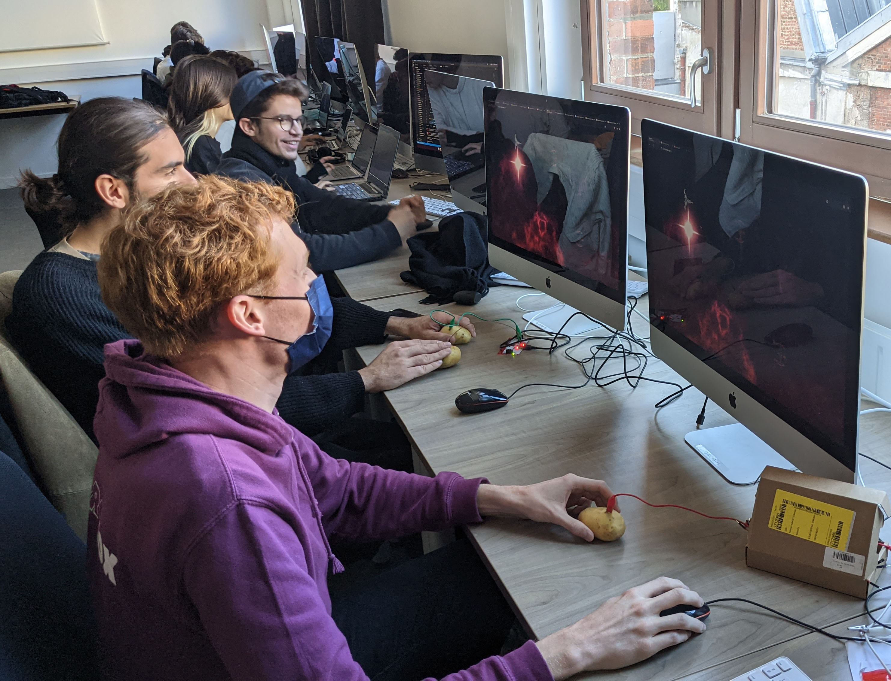
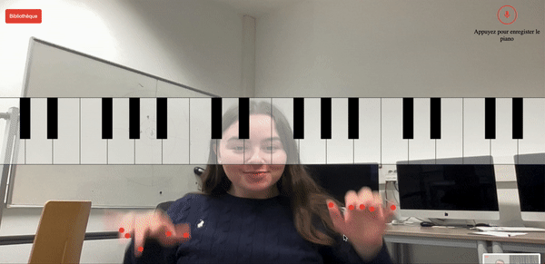

# toc

- [Lucien Boisseau-Sablé](#lucien)
- [Christelle Boquillion](#christelle)
- [Edward Brunetiere](#edward)
- [Victor Cango](#victorc)
- [Antoind Droyer](#antoined)
- [Léna Eng](#lena)
- [Antoind Galy](#antoined)
- [Ibrahima Kaba](#ibra)
- [Anna-Maria Lannaud](#annamaria)
- [Estellle Lay](#estelle)
- [Aurélien Louvel](#aurelien)
- [Jules Mesnil](#jules)
- [Néo Miannay](#neo)
- [Nicolas Neveu](#nicolas)
- [Louise Peridy](#louise)
- [Amandine Quellec](#amandine)
- [Clément Renou](#clement)
- [Adel Sanaa](#adel)
- [Victor Sin](#victors)

# lucien

[switch matter](https://github.com/LucienGobelins/SwitchMatter)

## auteur

[Lucien Boisseau](https://lucienboisseau.fr) [@LucienGobelins](https://github.com/LucienGobelins)

## l'expérience

Jeu multijoueur alliant adresse et convivialité. Chaque joueur armé de sa petites manettes Switch Joycon ® doit accumuler des diamants tout en pénalisant les autres joueurs en les percutant.

Plus le joueur a accumulé de diamants, moins il est vulnérable, mais plus il a de mal à se déplacer

## le but

L'expérienc eest une métaphore de l'insoutenable légerté de l'être qui porte à la méditation sur la vacuité de la vie et la futilité du du libre arbitre dans une logique de déterminisme absolu.

C'est une référence évidente à l'oevre de Stig Dagerman, notamment son pamphlet postume "Notre besoin de consolation est impossible à rassasier" – Vårt behov av tröst är omättligt — 1952.

## techno

javascript, express, socket.io, matterjs, gamepad api, café noisette

## license

Everyone is free to use my code. Crediting is optional but appriciated.

<!-- vous pouvez aussi opter pour la wtfpl http://www.wtfpl.net/ -->

# christelle

<!-- complétez ci-dessous les différentes parties et supprimez les commentaires, puis prévenez @gasp quand la pull request est prête-->

[LE_NOM_DU_PROJET](https://LE_LIEN_VERS_PAGE_GITHUB_README_OU_DEMO_EN_LIGNE)

## auteur

[VOTRE_NOM_ET_PRENOM](SITE_WEB_TWITTER_OU_NIMPORTE) [@USER_GITHUB](https://github.com/USER_GITHUB)

## l'expérience

DESCRIPTION DE L'EXPERIENCE, COMMENT CA SE PASSE

## le but

POURQUOI VOUS AVEZ FAIT CA, EST-CE QU'IL Y A UNE REFERENCE, UNE INSPIRATION

## techno

typescript, express, socket.io, matterjs, ETC

## license

CHOISISEZ COMMENT PEUT ETRE UTILISE VOTRE TRAVAIL

<!-- MIT, GPL, Creative Commons, vous pouvez aussi opter pour la wtfpl http://www.wtfpl.net/ -->

# edward

<!-- complétez ci-dessous les différentes parties et supprimez les commentaires, puis prévenez @gasp quand la pull request est prête-->

[LE_NOM_DU_PROJET](https://LE_LIEN_VERS_PAGE_GITHUB_README_OU_DEMO_EN_LIGNE)

## auteur

[VOTRE_NOM_ET_PRENOM](SITE_WEB_TWITTER_OU_NIMPORTE) [@USER_GITHUB](https://github.com/USER_GITHUB)

## l'expérience

DESCRIPTION DE L'EXPERIENCE, COMMENT CA SE PASSE

## le but

POURQUOI VOUS AVEZ FAIT CA, EST-CE QU'IL Y A UNE REFERENCE, UNE INSPIRATION

## techno

typescript, express, socket.io, matterjs, ETC

## license

CHOISISEZ COMMENT PEUT ETRE UTILISE VOTRE TRAVAIL

<!-- MIT, GPL, Creative Commons, vous pouvez aussi opter pour la wtfpl http://www.wtfpl.net/ -->

# victorc

<!-- complétez ci-dessous les différentes parties et supprimez les commentaires, puis prévenez @gasp quand la pull request est prête-->

[Abstraccct](https://LE_LIEN_VERS_PAGE_GITHUB_README_OU_DEMO_EN_LIGNE)

## auteur

[VOTRE_NOM_ET_PRENOM](SITE_WEB_TWITTER_OU_NIMPORTE) [@USER_GITHUB](https://github.com/USER_GITHUB)

## l'expérience

DESCRIPTION DE L'EXPERIENCE, COMMENT CA SE PASSE

## le but

POURQUOI VOUS AVEZ FAIT CA, EST-CE QU'IL Y A UNE REFERENCE, UNE INSPIRATION

## techno

typescript, express, socket.io, matterjs, ETC

## license

CHOISISEZ COMMENT PEUT ETRE UTILISE VOTRE TRAVAIL

<!-- MIT, GPL, Creative Commons, vous pouvez aussi opter pour la wtfpl http://www.wtfpl.net/ -->

# antoined

<!-- complétez ci-dessous les différentes parties et supprimez les commentaires, puis prévenez @gasp quand la pull request est prête-->

[LE_NOM_DU_PROJET](https://LE_LIEN_VERS_PAGE_GITHUB_README_OU_DEMO_EN_LIGNE)

## auteur

[VOTRE_NOM_ET_PRENOM](SITE_WEB_TWITTER_OU_NIMPORTE) [@USER_GITHUB](https://github.com/USER_GITHUB)

## l'expérience

DESCRIPTION DE L'EXPERIENCE, COMMENT CA SE PASSE

## le but

POURQUOI VOUS AVEZ FAIT CA, EST-CE QU'IL Y A UNE REFERENCE, UNE INSPIRATION

## techno

typescript, express, socket.io, matterjs, ETC

## license

CHOISISEZ COMMENT PEUT ETRE UTILISE VOTRE TRAVAIL

<!-- MIT, GPL, Creative Commons, vous pouvez aussi opter pour la wtfpl http://www.wtfpl.net/ -->

# lena

<!-- complétez ci-dessous les différentes parties et supprimez les commentaires, puis prévenez @gasp quand la pull request est prête-->

[LE_NOM_DU_PROJET](https://LE_LIEN_VERS_PAGE_GITHUB_README_OU_DEMO_EN_LIGNE)

## auteur

[VOTRE_NOM_ET_PRENOM](SITE_WEB_TWITTER_OU_NIMPORTE) [@USER_GITHUB](https://github.com/USER_GITHUB)

## l'expérience

DESCRIPTION DE L'EXPERIENCE, COMMENT CA SE PASSE

## le but

POURQUOI VOUS AVEZ FAIT CA, EST-CE QU'IL Y A UNE REFERENCE, UNE INSPIRATION

## techno

typescript, express, socket.io, matterjs, ETC

## license

CHOISISEZ COMMENT PEUT ETRE UTILISE VOTRE TRAVAIL

<!-- MIT, GPL, Creative Commons, vous pouvez aussi opter pour la wtfpl http://www.wtfpl.net/ -->

# antoined

<!-- complétez ci-dessous les différentes parties et supprimez les commentaires, puis prévenez @gasp quand la pull request est prête-->

[LE_NOM_DU_PROJET](https://LE_LIEN_VERS_PAGE_GITHUB_README_OU_DEMO_EN_LIGNE)

## auteur

[VOTRE_NOM_ET_PRENOM](SITE_WEB_TWITTER_OU_NIMPORTE) [@USER_GITHUB](https://github.com/USER_GITHUB)

## l'expérience

DESCRIPTION DE L'EXPERIENCE, COMMENT CA SE PASSE

## le but

POURQUOI VOUS AVEZ FAIT CA, EST-CE QU'IL Y A UNE REFERENCE, UNE INSPIRATION

## techno

typescript, express, socket.io, matterjs, ETC

## license

CHOISISEZ COMMENT PEUT ETRE UTILISE VOTRE TRAVAIL

<!-- MIT, GPL, Creative Commons, vous pouvez aussi opter pour la wtfpl http://www.wtfpl.net/ -->

# ibra

<!-- complétez ci-dessous les différentes parties et supprimez les commentaires, puis prévenez @gasp quand la pull request est prête-->

[LE_NOM_DU_PROJET](https://LE_LIEN_VERS_PAGE_GITHUB_README_OU_DEMO_EN_LIGNE)

## auteur

[VOTRE_NOM_ET_PRENOM](SITE_WEB_TWITTER_OU_NIMPORTE) [@USER_GITHUB](https://github.com/USER_GITHUB)

## l'expérience

DESCRIPTION DE L'EXPERIENCE, COMMENT CA SE PASSE

## le but

POURQUOI VOUS AVEZ FAIT CA, EST-CE QU'IL Y A UNE REFERENCE, UNE INSPIRATION

## techno

typescript, express, socket.io, matterjs, ETC

## license

CHOISISEZ COMMENT PEUT ETRE UTILISE VOTRE TRAVAIL

<!-- MIT, GPL, Creative Commons, vous pouvez aussi opter pour la wtfpl http://www.wtfpl.net/ -->

# annamaria

<!-- complétez ci-dessous les différentes parties et supprimez les commentaires, puis prévenez @gasp quand la pull request est prête-->

[Twitter trends airline](https://LE_LIEN_VERS_PAGE_GITHUB_README_OU_DEMO_EN_LIGNE)

## auteur

[Anna Maria](SITE_WEB_TWITTER_OU_NIMPORTE) [@AM-XIX](https://github.com/AM-XIX)

## l'expérience

DESCRIPTION DE L'EXPERIENCE, COMMENT CA SE PASSE

## le but

POURQUOI VOUS AVEZ FAIT CA, EST-CE QU'IL Y A UNE REFERENCE, UNE INSPIRATION

## techno

typescript, express, socket.io, matterjs, ETC

## license

CHOISISEZ COMMENT PEUT ETRE UTILISE VOTRE TRAVAIL

<!-- MIT, GPL, Creative Commons, vous pouvez aussi opter pour la wtfpl http://www.wtfpl.net/ -->

# estelle

<!-- complétez ci-dessous les différentes parties et supprimez les commentaires, puis prévenez @gasp quand la pull request est prête-->

[LE_NOM_DU_PROJET](https://LE_LIEN_VERS_PAGE_GITHUB_README_OU_DEMO_EN_LIGNE)

## auteur

[VOTRE_NOM_ET_PRENOM](SITE_WEB_TWITTER_OU_NIMPORTE) [@USER_GITHUB](https://github.com/USER_GITHUB)

## l'expérience

DESCRIPTION DE L'EXPERIENCE, COMMENT CA SE PASSE

## le but

POURQUOI VOUS AVEZ FAIT CA, EST-CE QU'IL Y A UNE REFERENCE, UNE INSPIRATION

## techno

typescript, express, socket.io, matterjs, ETC

## license

CHOISISEZ COMMENT PEUT ETRE UTILISE VOTRE TRAVAIL

<!-- MIT, GPL, Creative Commons, vous pouvez aussi opter pour la wtfpl http://www.wtfpl.net/ -->

# aurelien

<!-- complétez ci-dessous les différentes parties et supprimez les commentaires, puis prévenez @gasp quand la pull request est prête-->

[LE_NOM_DU_PROJET](https://LE_LIEN_VERS_PAGE_GITHUB_README_OU_DEMO_EN_LIGNE)

## auteur

[VOTRE_NOM_ET_PRENOM](SITE_WEB_TWITTER_OU_NIMPORTE) [@USER_GITHUB](https://github.com/USER_GITHUB)

## l'expérience

DESCRIPTION DE L'EXPERIENCE, COMMENT CA SE PASSE

## le but

POURQUOI VOUS AVEZ FAIT CA, EST-CE QU'IL Y A UNE REFERENCE, UNE INSPIRATION

## techno

typescript, express, socket.io, matterjs, ETC

## license

CHOISISEZ COMMENT PEUT ETRE UTILISE VOTRE TRAVAIL

<!-- MIT, GPL, Creative Commons, vous pouvez aussi opter pour la wtfpl http://www.wtfpl.net/ -->

# jules

<!-- complétez ci-dessous les différentes parties et supprimez les commentaires, puis prévenez @gasp quand la pull request est prête-->

[TadpolesJS](https://github.com/ElCurdente/PaperJS_P5Js_Experience)

## auteur

[Jules Mesnil](https://julesmesnil.fr) [@Julopipo](https://github.com/ElCurdente)

## l'expérience

Expérience interactive permettant de contrôler les mouvements d'un troupeau de têtards à sa guise grâce au tracking de la main. Ils reproduisent même les lignes de votre main c'est complètement fou !

## le but

Découvrir l'utilisation du tracking avec un canvas. Sinon c'est juste marrant

## techno

Javascript, express, socket.io, paperJS, p5.js

## license

CHOISISEZ COMMENT PEUT ETRE UTILISE VOTRE TRAVAIL

<!-- MIT, GPL, Creative Commons, vous pouvez aussi opter pour la wtfpl http://www.wtfpl.net/ -->

# neo

<!-- complétez ci-dessous les différentes parties et supprimez les commentaires, puis prévenez @gasp quand la pull request est prête-->

[LE_NOM_DU_PROJET](https://LE_LIEN_VERS_PAGE_GITHUB_README_OU_DEMO_EN_LIGNE)

## auteur

[VOTRE_NOM_ET_PRENOM](SITE_WEB_TWITTER_OU_NIMPORTE) [@USER_GITHUB](https://github.com/USER_GITHUB)

## l'expérience

DESCRIPTION DE L'EXPERIENCE, COMMENT CA SE PASSE

## le but

POURQUOI VOUS AVEZ FAIT CA, EST-CE QU'IL Y A UNE REFERENCE, UNE INSPIRATION

## techno

typescript, express, socket.io, matterjs, ETC

## license

CHOISISEZ COMMENT PEUT ETRE UTILISE VOTRE TRAVAIL

<!-- MIT, GPL, Creative Commons, vous pouvez aussi opter pour la wtfpl http://www.wtfpl.net/ -->

# nicolas

<!-- complétez ci-dessous les différentes parties et supprimez les commentaires, puis prévenez @gasp quand la pull request est prête-->

[LE_NOM_DU_PROJET](https://LE_LIEN_VERS_PAGE_GITHUB_README_OU_DEMO_EN_LIGNE)

## auteur

[VOTRE_NOM_ET_PRENOM](SITE_WEB_TWITTER_OU_NIMPORTE) [@USER_GITHUB](https://github.com/USER_GITHUB)

## l'expérience

DESCRIPTION DE L'EXPERIENCE, COMMENT CA SE PASSE

## le but

POURQUOI VOUS AVEZ FAIT CA, EST-CE QU'IL Y A UNE REFERENCE, UNE INSPIRATION

## techno

typescript, express, socket.io, matterjs, ETC

## license

CHOISISEZ COMMENT PEUT ETRE UTILISE VOTRE TRAVAIL

<!-- MIT, GPL, Creative Commons, vous pouvez aussi opter pour la wtfpl http://www.wtfpl.net/ -->

# louise

<!-- complétez ci-dessous les différentes parties et supprimez les commentaires, puis prévenez @gasp quand la pull request est prête-->

[Burning Kitchen](https://LE_LIEN_VERS_PAGE_GITHUB_README_OU_DEMO_EN_LIGNE)

## auteur

[VOTRE_NOM_ET_PRENOM](SITE_WEB_TWITTER_OU_NIMPORTE) [@USER_GITHUB](https://github.com/USER_GITHUB)

## l'expérience

DESCRIPTION DE L'EXPERIENCE, COMMENT CA SE PASSE

## le but

POURQUOI VOUS AVEZ FAIT CA, EST-CE QU'IL Y A UNE REFERENCE, UNE INSPIRATION

## techno

typescript, express, socket.io, matterjs, ETC

## license

CHOISISEZ COMMENT PEUT ETRE UTILISE VOTRE TRAVAIL

<!-- MIT, GPL, Creative Commons, vous pouvez aussi opter pour la wtfpl http://www.wtfpl.net/ -->

# amandine

<!-- complétez ci-dessous les différentes parties et supprimez les commentaires, puis prévenez @gasp quand la pull request est prête-->

[Air Piano](https://github.com/aquellec/air-piano)

## auteur

QUELLEC Amandine [@aquellec](https://github.com/aquellec)

## l'expérience

Grâce à Air Piano, vous pouvez jouer du piano dans l'air. La caméra détecte vos mains, et notamment lorsque que vous appuyez sur les touches du piano. Également, vous pouvez partager en ligne vos morceaux !

## le but

J'ai toujours eu de l'intérêt pour le piano, cela m'a paru évident qu'il soit au coeur de mon projet. J'ai puisé mon inspiration dans l'invention de Omer Yosha. Il a inventé un instrument qui s'appelle le AirPiano et qui, par le biais de 8 capteurs infrarouges permet de jouer une note en fonction de la distance verticale de la main par rapport à l'intrument.

## techno

javascript, express, socket.io, mediapipe

## license

Everyone is free to use my code. Crediting is optional but appriciated.

<!-- MIT, GPL, Creative Commons, vous pouvez aussi opter pour la wtfpl http://www.wtfpl.net/ -->

# clement

<!-- complétez ci-dessous les différentes parties et supprimez les commentaires, puis prévenez @gasp quand la pull request est prête-->

[LE_NOM_DU_PROJET](https://LE_LIEN_VERS_PAGE_GITHUB_README_OU_DEMO_EN_LIGNE)

## auteur

[VOTRE_NOM_ET_PRENOM](SITE_WEB_TWITTER_OU_NIMPORTE) [@USER_GITHUB](https://github.com/USER_GITHUB)

## l'expérience

DESCRIPTION DE L'EXPERIENCE, COMMENT CA SE PASSE

## le but

POURQUOI VOUS AVEZ FAIT CA, EST-CE QU'IL Y A UNE REFERENCE, UNE INSPIRATION

## techno

typescript, express, socket.io, matterjs, ETC

## license

CHOISISEZ COMMENT PEUT ETRE UTILISE VOTRE TRAVAIL

<!-- MIT, GPL, Creative Commons, vous pouvez aussi opter pour la wtfpl http://www.wtfpl.net/ -->

# adel

<!-- complétez ci-dessous les différentes parties et supprimez les commentaires, puis prévenez @gasp quand la pull request est prête-->

[LE_NOM_DU_PROJET](https://LE_LIEN_VERS_PAGE_GITHUB_README_OU_DEMO_EN_LIGNE)

## auteur

[VOTRE_NOM_ET_PRENOM](SITE_WEB_TWITTER_OU_NIMPORTE) [@USER_GITHUB](https://github.com/USER_GITHUB)

## l'expérience

DESCRIPTION DE L'EXPERIENCE, COMMENT CA SE PASSE

## le but

POURQUOI VOUS AVEZ FAIT CA, EST-CE QU'IL Y A UNE REFERENCE, UNE INSPIRATION

## techno

typescript, express, socket.io, matterjs, ETC

## license

CHOISISEZ COMMENT PEUT ETRE UTILISE VOTRE TRAVAIL

<!-- MIT, GPL, Creative Commons, vous pouvez aussi opter pour la wtfpl http://www.wtfpl.net/ -->

# victors

<!-- complétez ci-dessous les différentes parties et supprimez les commentaires, puis prévenez @gasp quand la pull request est prête-->

[LE_NOM_DU_PROJET](https://LE_LIEN_VERS_PAGE_GITHUB_README_OU_DEMO_EN_LIGNE)

## auteur

[VOTRE_NOM_ET_PRENOM](SITE_WEB_TWITTER_OU_NIMPORTE) [@USER_GITHUB](https://github.com/USER_GITHUB)

## l'expérience

DESCRIPTION DE L'EXPERIENCE, COMMENT CA SE PASSE

## le but

POURQUOI VOUS AVEZ FAIT CA, EST-CE QU'IL Y A UNE REFERENCE, UNE INSPIRATION

## techno

typescript, express, socket.io, matterjs, ETC

## license

CHOISISEZ COMMENT PEUT ETRE UTILISE VOTRE TRAVAIL

<!-- MIT, GPL, Creative Commons, vous pouvez aussi opter pour la wtfpl http://www.wtfpl.net/ -->
