# experience canvas + webaudio

## sujet

en utilisant les canvas et la web-audio api, l'utilisateur doit vivre une expérience interactive. Vous pouvez utiliser les interface homme-machine tels que clavier, souris, gamepad, caméra, micro, leap motion, entrées midi...

Cette expérience doit être partagée
- soit en temps réel avec un autre utilisateur
- soit à posteriori avec une restitution

# toc

- [wave.more](#wavemore) par Yaoyi Luo
- [space ship](#space-ship) par Julien Vanroy
- [pimp my hibou](#pimp-my-hibou) par juliette sage--aubriot
- [parle avec toto](#parle-avec-toto) par chloe sans
- [lowpass seigfried](#lowpass-seigfried) par Karl Justiniano
- [blue](#blue) par Gregory Colombe
- [speakinggg](#speakinggg) par An Truong
- [fire ice cream](#fire-ice-cream) par Serge Bocancea
- [space3000](#space3000) par Léon Baudouin
- [project sound](#project-sound) par Emilien Vandevelde
- [le piano des animaux](#le-piano-des-animaux) par Vincent Largillet
- [cerfs volants theremin](#cerfs-volants-theremin) par Morgane Sauneuf
- [cantar](#cantar) par Michael de Laborde
- [generative forest](#generative-forest) par Marius Ballot
- [space mess](#space-mess) par Théo Lemoine
- [game of life sound evolution](#game-of-life-sound-evolution) par Aurelien Hemidy
- [casse-brique](#casse-brique) par Yann Chabot-Thomas
- [space invaders mind](#space-invaders-mind) par Ludovic Pouyaut
- [spectrum](#spectrum) par Pablo Aparicio
- [accordeur vocal](#accordeur-vocal) par Léo Mouraire
- [ns-03_theremin](#ns-03_theremin) par Arno Dubois

<!--
l'experience
l'intéraction
la restitution
le but ()

captation
screenshot
la license
-->

# wave.more

"This works so far"

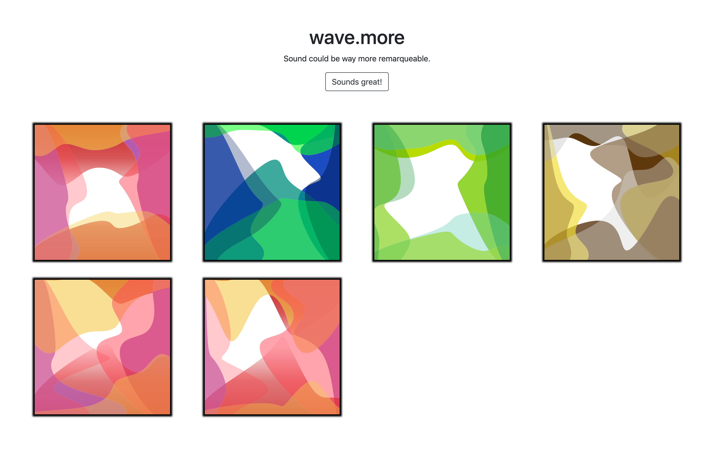

## auteur
Yaoyi Luo

## l'expérience
en chantant / parlant devant un microphone l'utilisateur dessine des formes colorées

## le but
chaque voix est unique, nous avons l'habitude de l'entendre, wave.more permet de se rendre compte de cette unicité en visualisant les voix

## restitution
les empreintes de voix sont en suite accessibles dans une gallerie d'images

## techno
vanilla javascript, paperjs, express

## license
à définir

# space ship

pioupiou vivent les lasers

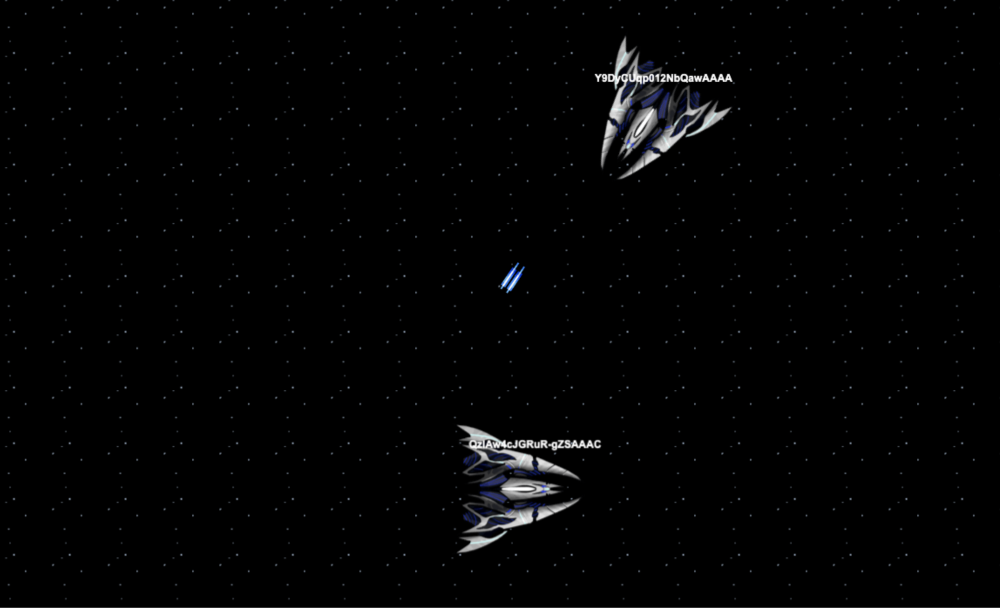

## auteur
Julien Vanroy
[@jujuonelove](http://github.com/jujuonelove)
http://spaceship.julienvanroy.fr/

## l'experience
jeu [asteroid-like](https://en.wikipedia.org/wiki/Asteroids_(video_game)) multijoueur en réseau

## techno
phaser, socket.io

## license
[wtfpl](http://www.wtfpl.net/)

# pimp my hibou

une expérience à dormir debout

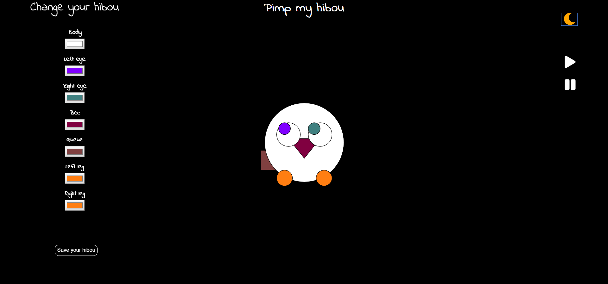

## auteur

juliette sage--aubriot
@juliettesageaubriot

## l'experience

L'utilisateur peut configurer son avatar sous forme d'un hibou et le partager avec d'autres utilisateurs

## technos

paperjs, express

## license

[wtfpl](http://www.wtfpl.net/)

# parle avec toto

il a un sacré accent québécois

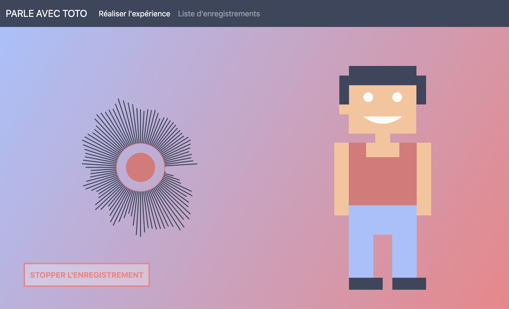

## auteur

chloe sans
@chloesans

## l'experience

toto est un ami virtuel avec-lequel l'enfant dialogue et apprend à distinguer les différentes parties du corps

## la restitution
les conversations entre l'enfant et toto

## technos
paperjs, webaudio, express

## license
cc by sa 4.0

# lowpass seigfried
visualisation de spectre audio en 3d

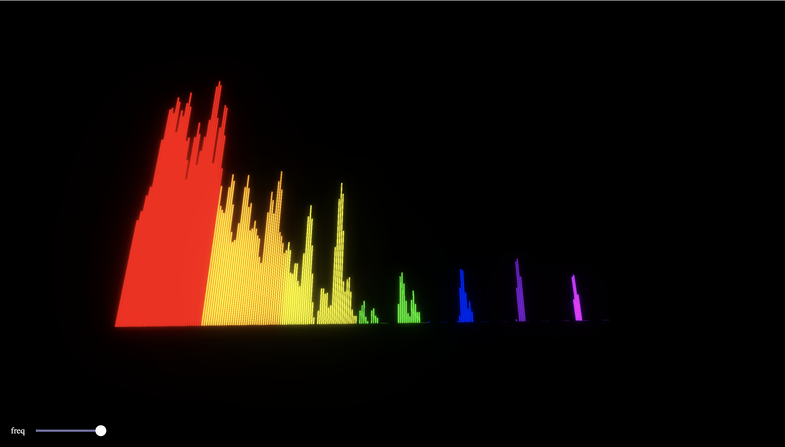

## auteur

Karl Justiniano
@karljstn

## l'experience
à partir d'une cover de Franck Ocean - Seigfried par Justice Der, l'utilisateur peut appliquer un filtre et donc modifier le rendu sonore du morceau en visualisant le spectre des fréquences

## technos
threejs, webaudioapi, express

## restitution
un enregistrement de 9 secondes d'une variation du morceau

## license
compliqué puisque utilise la cover une œuvre soumise au copyright :-)

# blue

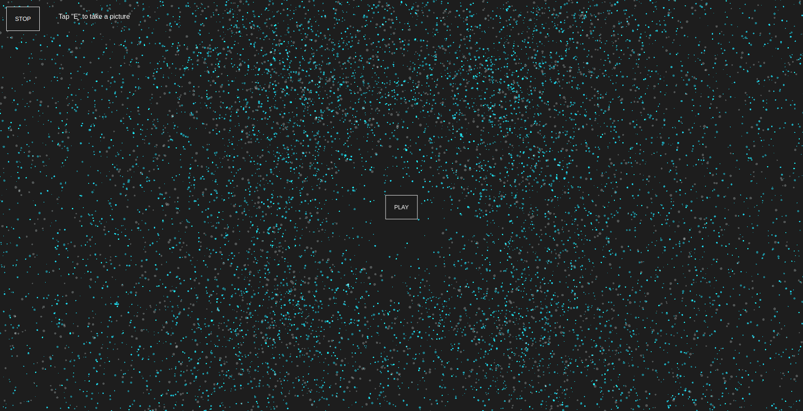

## auteur

Gregory Colombe
@GregoryColombe

Sur le morceau "In the end" de la collaboration entre XXXTentacion et Lil Peep pour leur album "Falling down", l'utilisateur peut à l'aide de sa souris jouer avec la spacialisation du son et visualise cette balance gauche-droite avec un nuage de particules bleues.

## technos
pixi, weaudio, express

## license
cc by sa 4.0
c'est compliqué car se base sur une œuvre soumise au copyright

# speakinggg

une expérience de communication entre la voix et la visualisation de la voix

## auteur

An Truong
@sdsmnc221

- démo: https://speakinggg.herokuapp.com
- code: http://github.com/sdsmnc221/speakinggg

## experiment

chat texte entre utilisateurs dictant leurs messages en visualisant le pitch, les mots prononcés, le volume et les fréquences vocales

## technos
google speech recognition, webaudio, paper, socket.io

# fire ice cream
le jeu qui te fera crier

## auteur

Serge Bocancea

## experiment
un [flappy-bird like](https://en.wikipedia.org/wiki/Flappy_Bird) controllé par la voix, très ludique

## restitution
leaderboard

## technos
canvas, webaudio, express

## license
MIT
design: luc miramont

# space3000
jeu d'obstacles contrôlé à la voix
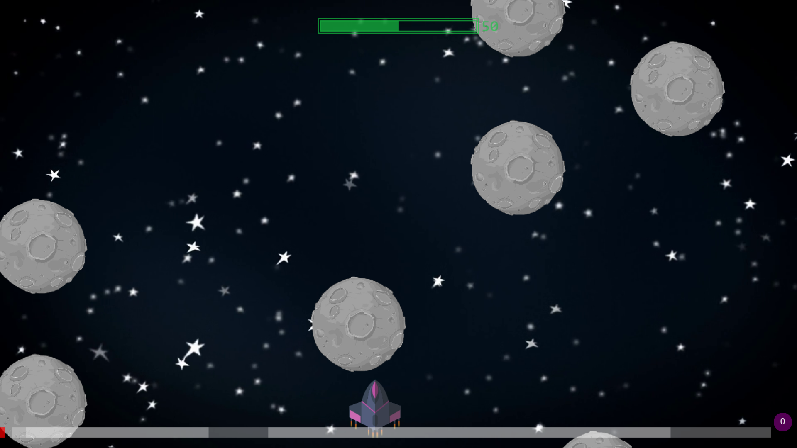

## auteur
Léon Baudouin
@leonbaudouin

space3000

## experiment
jeu d'obstacles contrôlé par la tonalité de la voix

## restitution
des enregistrements débiles

## technos
canvas, baudouinframework, collisions, webaudio, express

## license
cc by sa 4.0
framework: mit

# project sound

## auteur
Emilien Vandevelde
@emilien-v

## experiment

experience de visualisation d'un morceau de musique qui interagit en fonction des fréquences sonores.
L'utilisateur peut aussi influencer le résultat

## restitution
un instantané du morceau

## technos
paper, webaudio, express

## license
cc by sa 4.0

# le piano des animaux
le cri des animaux comme notes de musique

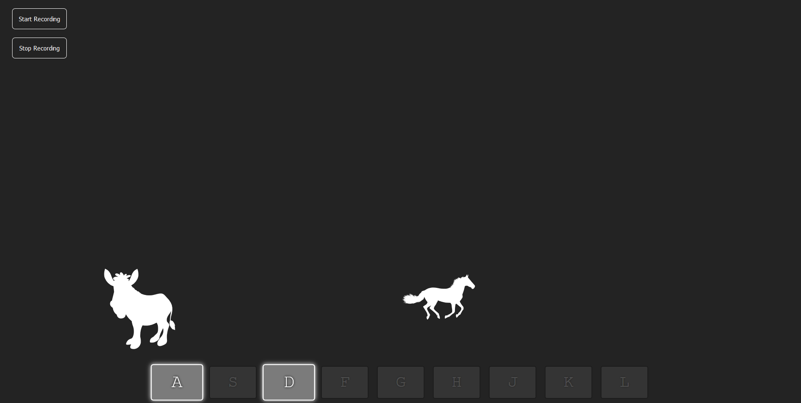

## auteur
Vincent Largillet
@vincentlrg

## experiment
un piano qui en guise de note emmet des cris d'animaux

## but
faire découvrir aux enfants le cris des animaux dans une expérience multimédia et interactive

## restitution
des morceaux composés de cris d'animaux

## technos
webaudio, canvas, express

## license

cc by sa 4.0

# cerfs volants theremin

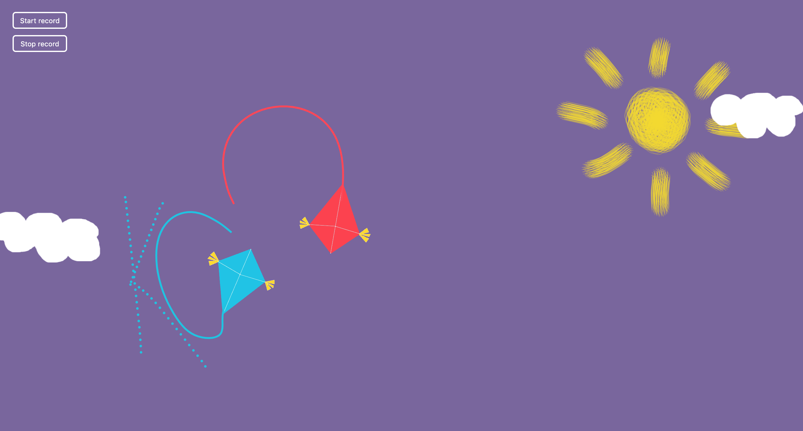

Morgane Sauneuf
@morganesauneuf

cerf volants theremin

## experiment

deux joueurs font voler des cerfs volants grâce à des manettes de console et composent une musique électronique

## restitution
des harmoniques composées à plusieurs

## technos
webaudio, paper, express, gamepadapi

# cantar
une expérience apaisante
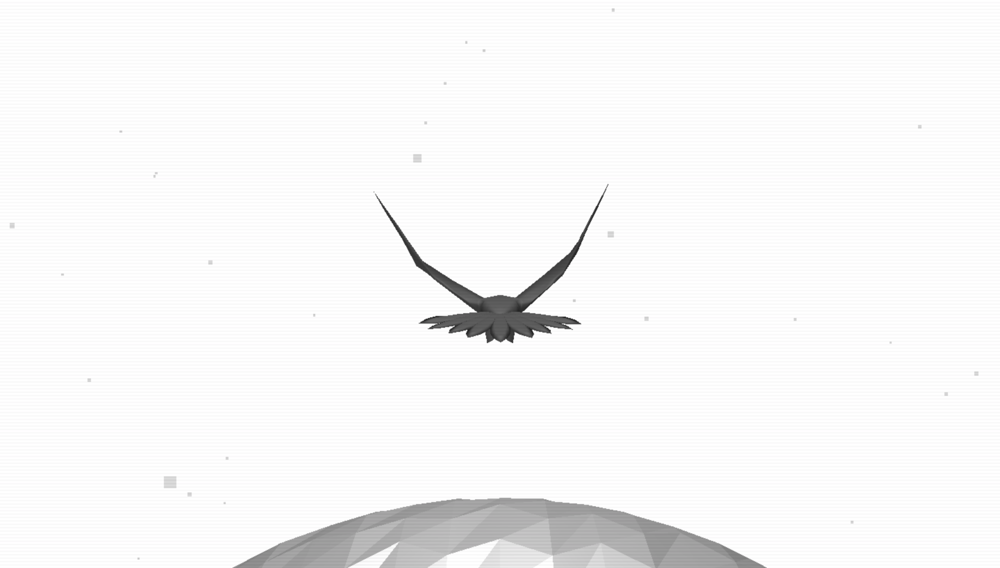

## auteur
Michael de Laborde

## experiment
expérience relaxante où l'utilisateur incarne un autour des palombes (rapace) au vol régilier

dirigeant son vol, l'utilisateur va faire varier l'ambiance sonore

## restitution
enregistrement de l'expérience

## technos
three, react, webaudioapi, gamepad, gsap tweenmax

## license
cc by 4.0

# generative forest

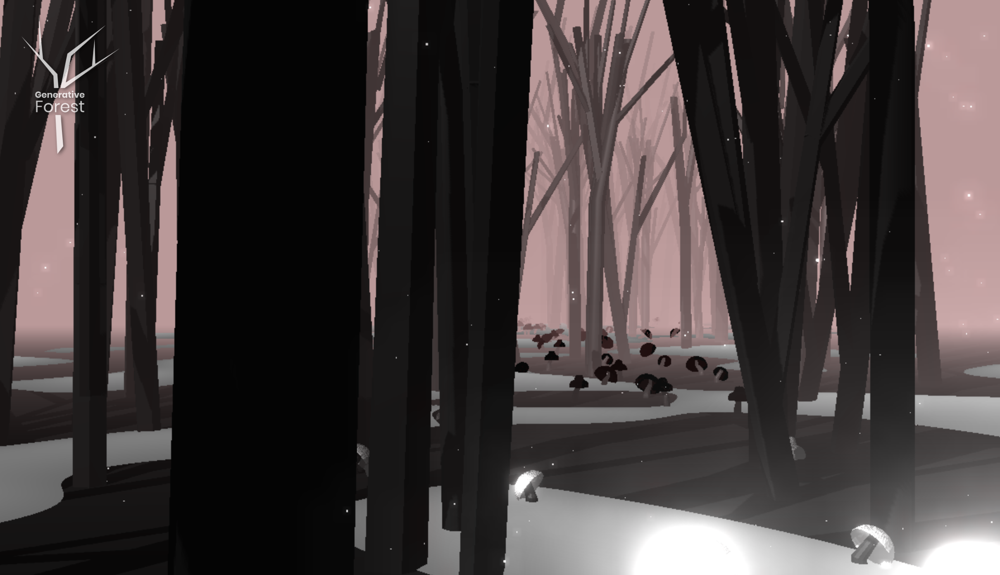

## auteur
Marius Ballot
@mariusballot

- code source https://github.com/MariusBallot/GenerativeForest
- demo https://www.mariusballot.com/lab/generativeForest/

## experiment

experience immersive dans un environnement 3D génératif

## restitution
aucune

## technos

threejs, glsls, webaudioapi, c4d, blender, fl studio

## license
cc by sa 4.0

# space mess

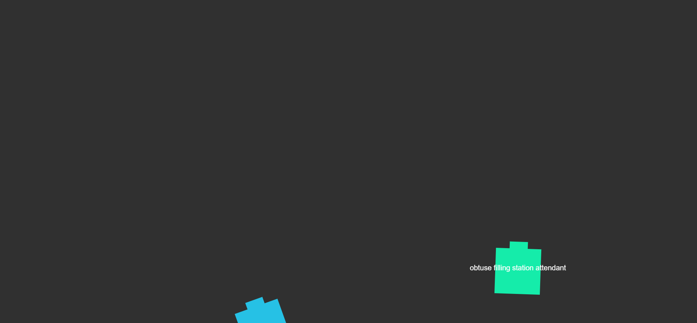

## auteur
Théo Lemoine
@TheoLemoine

## experiment

asteroid-like multi-joueur piloté par le giroscope du téléphone

## technos

socket.io express paperjs deviceorientation webaudioapi

# game of life sound evolution
design génératif visuel et sonore

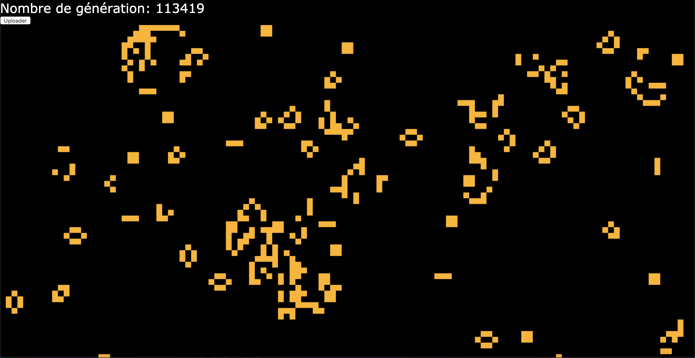

## auteur
Aurelien Hemidy
@aurelien.hmdy

## experiment

un écran de design génératif affiche des pixels avec la logique du game of life et en fonction de son comportement va générer une musique

## restitution

musique aléatoires générées par des sessions de jeu

## technos
canvas, express, webaudio

## license
wtfpl

# casse-brique
un casse-brique sonore

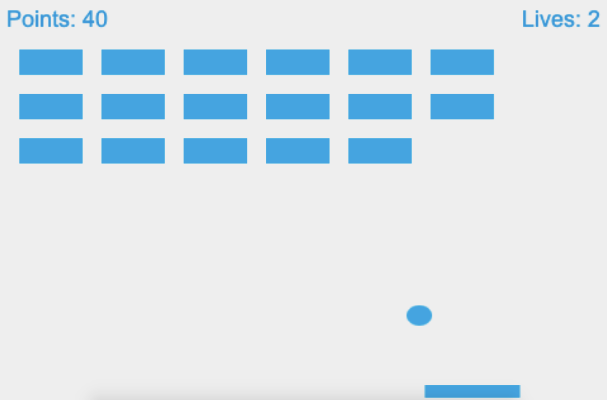

Yann Chabot-Thomas
@ychabot-thomas

## experiment

un casse-brique où le joueur est injectivé au cours de sa partie

## restitution
leaderboard

## technos
phase, express

## license
dual MIT wtfpl

# space invaders mind

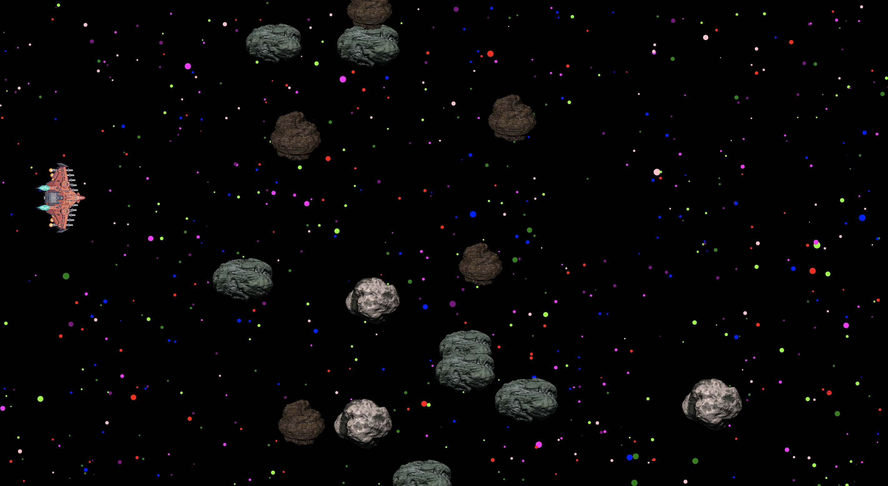

## auteur
Ludovic Pouyaut
@ludoPyt

## experience

shoot them up rythmique: le décors de ce jeu réagit à la bande son : l'impératrice 'agitation tropicale',  

## restitution
aucune

## technos
paperjs webaudioapi, express

## license
compliqué car utilise musique non libre de droit

# spectrum

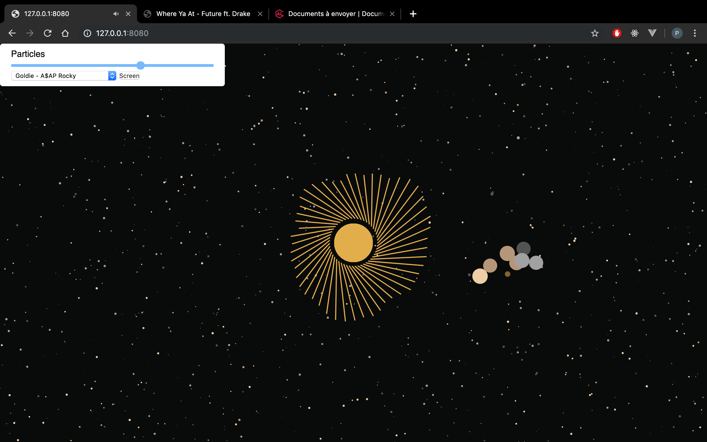

## auteur
Pablo Aparicio
@paaparicio

sprectrum

## experiment
c'est un audio visualiser: l'utilisateur peut ajuster différents types de rendus qui sont animés par le son joué et les mouvements de souris

## restitution
screeshots / pochettes d'album

## technos
canvas, webaudio, express

# accordeur-vocal

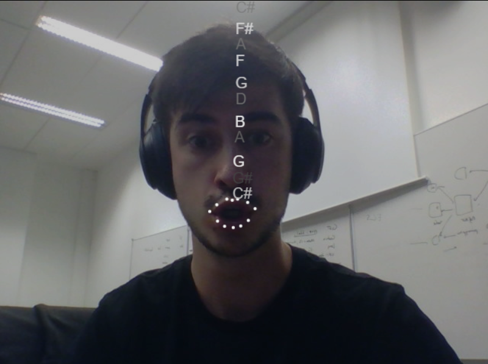

## auteur
Léo Mouraire
@leochocolat

- code source https://github.com/leochocolat/CanvasSound

## experiment

c'est comme un mirroir qui retransmet de manière graphique la hauteur de la voix: l'utilisateur se voit et quand il parle ou chante, voit les notes sortir de sa bouche. la note la plus proche de celle qu'il chante lui est donnée en feedback dans le casque audio

## restitution

instantanés de l'expérience

## technos
webAudioApi, canvas, express, faceapi.js, tone.js, pitch detection

## license
dépend des licenses des composants

# ns-03_theremin
une interface naturelle de theremin

## auteur
Arno Dubois
@arno500

## experiment

en accorchant des joy-con à ses poignets, l'utilisateur joue du thérémin sans avoir d'interface

## restitution
aucune

## technos

websocket, pixi, ns-joycon (node), webaudio
